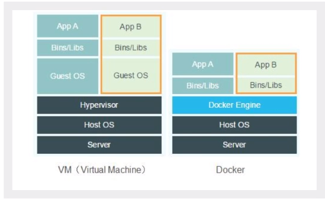

# Docker基本概念、安装

Docker通过隔离机制，可以将服务器利用到极致

比较Docker和虚拟机技术的不同：

- 传统虚拟机，虚拟出一套硬件，运行一个完整的操作系统，然后再这个系统上安装的运行软件。
- 容器内的应用直接运行在宿主机内，容器没有自己的内核，也没有虚拟硬件。
- 每个容器时互相隔离的，每个容器内都有一个属于自己的文件系统，互不影响。
- Docker时内核级别的虚拟化，可以在一台物理机上运行很多的容器实例，服务器性能可以被压榨到极致。


## 1 基本概念

### 1.1 镜像（image）

docker镜像就好比一个模板，可以通过这个模板来创建容器服务
通过这个镜像可以创建多个容器，（最终服务运行或者项目运行就是在容器中）

### 1.2 容器（container）

Docker利用容器技术，独立运行一个独立或者一组应用，通过镜像来创建
启动，停止，删除，基本命令
目前可以把这个容器理解为就是一个简易的linux系统

### 1.3 仓库（repository）

仓库就是存放镜像的地方

## 2 安装

1. 卸载旧版本

```sh
yum remove docker \
           docker-client \
           docker-client-latest \
           docker-common \
           docker-latest \
           docker-latest-logrotate \
           docker-logrotate \
           docker-engine
```

2. 配置yum源

```sh
wget http://mirrors.aliyun.com/docker-ce/linux/centos/docker-ce.repo -O /etc/yum.repos.d/docker-ce.repo

# RHEL7 需要额外执行
sed -i 's/\$releasever/7/g' /etc/yum.repos.d/docker-ce.repo
```

3. 安装

```sh
yum install docker-ce docker-ce-cli containerd.io

# 安装其他版本：
# yum list docker-ce --showduplicates | sort -r
```

4. 测试

```sh
systemctl start docker
docker run hello-world
```

5. 卸载

```sh
yum remove docker-ce docker-ce-cli containerd.io
rm -rf /var/lib/docker  # docker默认工作路径
```

## 3 镜像加速

```sh
vim /etc/docker/daemon.json
{ "registry-mirrors": ["https://hld637c8.mirror.aliyuncs.com"] }  # 添加此行，hld637c8为每个阿里云账号分配的ID

{ "registry-mirrors": ["https://docker.mirrors.ustc.edu.cn"] }    # 清华
```

### `docker run`过程


```sh
[root@mgr ~]# docker run hello-world
Unable to find image 'hello-world:latest' locally
latest: Pulling from library/hello-world
0e03bdcc26d7: Pull complete 
Digest: sha256:7e02330c713f93b1d3e4c5003350d0dbe215ca269dd1d84a4abc577908344b30
Status: Downloaded newer image for hello-world:latest

Hello from Docker!
This message shows that your installation appears to be working correctly.

To generate this message, Docker took the following steps:
 1. The Docker client contacted the Docker daemon.
 2. The Docker daemon pulled the "hello-world" image from the Docker Hub.
    (amd64)
 3. The Docker daemon created a new container from that image which runs the
    executable that produces the output you are currently reading.
 4. The Docker daemon streamed that output to the Docker client, which sent it
    to your terminal.

To try something more ambitious, you can run an Ubuntu container with:
 $ docker run -it ubuntu bash

Share images, automate workflows, and more with a free Docker ID:
 https://hub.docker.com/

For more examples and ideas, visit:
 https://docs.docker.com/get-started/

```

## 4 docker 底层原理

Docker时一个Client-Server结构的系统，Docker的守护进程运行在主机上。通过Socket从客户端访问， Docker Server接收到Docker Client的指令，就会执行这个命令。


### Docker为什么比VM快？

1. docker有着比VM更少的抽象层



2. docker利用的是宿主机的内核，vm需要的是Guest OS；新建容器的时候，docker不需要重新加载操作系统，避免引导，而是直接使用当前操作系统
