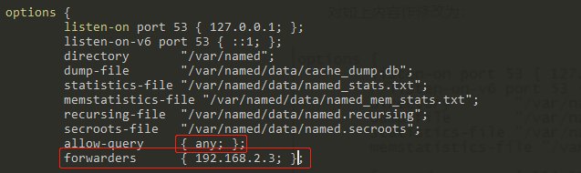
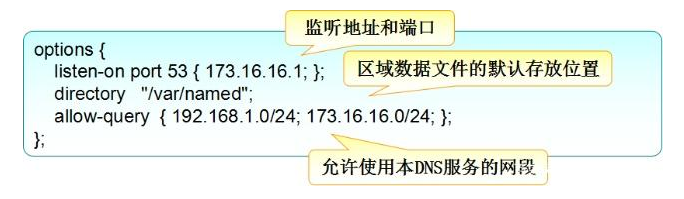
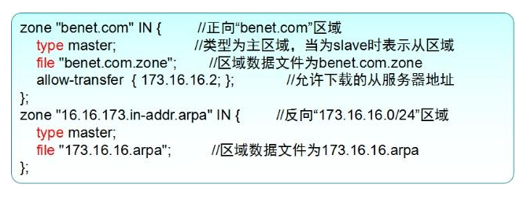

### 1.安装bind包

```sh
yum install bind*
```

### 2.检查包的安装情况

```sh
[root@qwerdns ~]# rpm -qa |grep '^bind'
bind-pkcs11-libs-9.9.4-72.el7.x86_64
bind-dyndb-ldap-11.1-4.el7.x86_64
bind-pkcs11-9.9.4-72.el7.x86_64
bind-utils-9.9.4-72.el7.x86_64      #提供了对DNS服务器的测试工具程序，如nslookup等
bind-license-9.9.4-72.el7.noarch
bind-libs-9.9.4-72.el7.x86_64       #提供了bind、bind-utils需要使用的函数
bind-9.9.4-72.el7.x86_64            #提供了域名服务的主要程序及相关文件
bind-chroot-9.9.4-72.el7.x86_64     #为BIND服务提供一个伪装的根目录（将/var/named/chroot/文件夹作为BIND的根目录），以提高安全性。
bind-pkcs11-utils-9.9.4-72.el7.x86_64
bind-libs-lite-9.9.4-72.el7.x86_64
```

### 3.BIND服务控制

BIND软件包安装完毕以后，会自动增加一个名为named的系统服务，通过脚本文件`/etc/init.d/named`或`systemctl`、`service`（centos6以前）工具都可以控制DNS域名服务的运行。

其他：  
- 主要执行程序：`/usr/sbin/named`  
- 服务脚本：`/etc/init.d/named`  
- 默认监听端口：`53`(TCP and UDP)  


### 4.BIND服务的配置文件

使用BIND软件构建域名服务时，主要涉及两种类型的配置文件：**主配置文件**和**区域数据文件**。  
- 主配置文件用于设置named服务的全局选项、注册区域及访问控制等各种运行参数  
- 区域数据文件用于保存 DNS 解析记录的数据文件（正向或反向记录）  

#### 1）主配置文件

`/etc/named.conf`（安装的是bind-xxx软件包）  
`/var/named/chroot/etc/named.con`f（安装的是bind-chroot-xxx软件包）  

> 主配置文件中，主要包括**全局配置**、**区域配置**两个部分，每一条配置记录的行尾以分号 ";" 表示结束，以 "#" 号或 "//" 开始的部分表示注释文字（大段注释可以使用 "/*......*/" 的格式）


`forwarders`字段：对本地无法解析的域名（即除*.qwer.com）的域名都转到192.168.2.3上解析。在买运营商带宽时，运营商会提供IP地址与dns服务器，这时可以直接加在forwarders字段。

`allow-query`字段：允许获取解析的服务器

#!!!#注：需要配置监听端口
```
listen-on port 53 { 192.168.163.233; }; 
```
或者： 
```
listen-on port 53 { any; }; 
```

<center>



</center>


##### a) 全局配置部分

<center>



</center>

如上图所示：  
- 使用 options { …… }; 的配置段  
- 设置 DNS 服务器的全局参数，包括**监听地址/端口**、**数据文件的默认位置** 等  


##### b) 区域配置部分

<center>



</center>

如上图所示：  
- 使用 zone “区域名” IN { …… }; 的配置段  
- 设置本服务器提供域名解析的特定 DNS 区域， 包括**域名**、**服务器角色**、**数据文件名**等


#### 2）区域数据配置文件（保存 DNS 解析记录的数据文件）

`/var/named/`（安装的是bind-xxx软件包）  
`/var/named/chroot/var/named/`（安装的是bind-chroot-xxx软件包）  

> 1. 每个区域数据文件对应一个DNS解析区域，文件名及内容由该域的管理员自行设置。（要与在全局配置中指定的文件名一样，不然会出错）  
> 2. 在区域数据文件中，主要包括**TTL配置项**、**SOA**（Start Of Authority，授权信息开始）记录、**地址解析记录**。文件中的注释信息以分号 ";" 开始。

##### a) 全局 TTL 配置项及 SOA 记录

<center>


</center>

如上图所示：  
- `@` 表示当前的DNS区域名，相当于"benet.com.""  
- `$TTL`（Time To Live，生存时间）记录  
- `SOA`（Start Of Authority，授权信息开始）记录  
- `;` 开始的部分表示注释信息


##### b) 域名解析记录

###### 正向解析记录

<center>


</center>


如上图所示：  
- `NS` 域名服务器（Name Server）：记录当前区域的DNS服务器的主机地址
- `MX` 邮件交换（Mail Exchange）：记录当前区域的邮件服务器的主机地址，数字10表示优先级。
- `A` 地址（Address）：记录正向解析条目，只用在正向解析区域中
- `CNAME` 别名（Canonical Name）：记录某一个正向解析条目的其他名称

注：其中，`NS`、`MX`记录行首的`@`符号可以省略（默认继承`SOA`记录行首的`@`信息），但是必须保留一个空格或Tab制表位。

###### 反向解析记录

<center>


</center>

如上图所示：  
- `PTR` 指针（Point）记录，只用在反向解析区域中
- 记录的第一列指定 IP 地址中的主机地址部分即可。如，上述中的`4 IN PTR mail.benet.com.`表示**IP地址为173.16.16.4的主机的域名时maiil.benet.com.** 。

注：在区域数据配置文件中，凡是不以点号“.”结尾的主机地址，系统在查找地址记录时都会自动将当前的域名作为后缀。例如，若当前的DNS域为“benet.com”，则在文件中的主机地址“www”相当于“www.benet.com.”。因此，当使用完整的FQDN地址时，务必记得地址末尾的点号“.”不能省略。

### 5 日志配置

在默认情况下，BIND 9 把日志消息写到 `/var/log/messages` 文件中，而这些日志消息是非常少的，主要就是启动，关闭的日志记录和一些严重错误的消息；而将调试日志信息写入 BIND 服务器工作目录中的 `named.run` 文件。

BIND 9 的日志是可以灵活配置的，要详细记录服务器的运行状况，要在配置文件 `named.conf` 中使用 `logging` 语句来定制自己所需要的日志记录。

#### 1) Bind日志的常用术语

术语	            |含义
----                |----
channel（通道）	    |日志输出方式，如：syslog、文本文件、标准错误输出或 /dev/null
category（类别）	|日志的消息类别，如：查询消息或动态更新消息等
module（模块）	    |产生消息的来源模块名称
facility（设备）	|syslog 设备名
severity（严重性）	|消息的严重性等级


#### 2) logging 语句的语法

```
logging {
        channel channel_name {                  // 定义通道
                file log_file [versions number | unlimited] [size sizespec]; | syslog optional_facility; | null; | stderr;      // 定义输出方式
                severity log_severity;           // 定义消息严重性
                [print-time boolean;]            // 是否(yes/no)在消息中添加时间前缀，仅用于 file 日志
                [print-severity boolean;]        // 是否在消息中添加消息严重性前缀
                [print-category boolean;]        // 是否在消息中添加消息类别名前缀
        };
        category category_name {                 // 定义类别
                channel_name;
                ......
       };
};
```
##### a) channel 语句

channel语句用于定义通道

BIND 9 预制了如下四个默认通道:   
```
channel "default_syslog" {
        syslog daemon;     // 发送给 syslog 的 daemon 设备
        severity info;     // 只发送此 info 及其更高优先级的信息
};
```
```
channel "default_debug" { // 只有当服务器的 debug 级别非 0 时，才产生输出。
        file "named.run"; // 写入工作目录下的 named.run 文件
        severity dynamic; // 按照服务器当前的debug 级别记录日志
};
```
```
channel "default_stderr" {
        stderr;           // 写到stderr
        severity info;    // 只发送此 info 及其更高优先级的信息
};
```
```
channel "null" {
	    null;             // 丢弃所有发到此通道的信息
};
```


<br>

###### 定义输出方式

以下四种之间选一： 

- **file**: 输出到纯文本文件  
    * `log_file`: 指定一个文件名  
    * `version` : 指定允许同时存在多少个版本的该文件，比如指定 3 个版本（version 3），就会保存 query.log、query.log0、query.log1 和query.log2。  
    * `size` : 指定文件大小的上限，如果只设定了`size` 而没有设定 `version`，当文件达到指定的文件大小上限时，服务器停止写入该文件。如果设定了`version`，服务器会进行循环，如把 log_file 变成 log_file.log1，log_file.log1 变成 log_file.log2 等，然后建立一个新的 log_file.log 进行写入。 

- **syslog optional_facility**: 输出到 syslog，其中 optional_facility 是 syslog 的设备名，通常为以下几个:  
    * `daemon`  
	* `local0` ... `local7`  
- **null**: 输出到空设备  
- **stderr**: 输出到标准错误输出，默认为屏幕  

<br>

###### 定义消息严重性

`severity log_severity`, 指定消息的严重性等级

log_severity 的取值（按照严重性递减的顺序）
* critical  
* error  
* warning  
* notice  
* info  
* debug [ level ]  
* dynamic (匹配服务器当前的调试级别)*   


##### b) category 语句

指定哪一种类别的信息使用哪个或者哪几个已经定义了的通道输出。

BIND 9 中可用的类别名（category_name）有：

类别	|说明
----    |----
client 	|处理客户端请求。
config 	|配置文件分析和处理。
database| 	同BIND内部数据库相关的消息，用来存储区数据和缓存记录。
default |	匹配所有未明确指定通道的类别。
dnssec 	|处理 DNSSEC 签名的响应。
general |	包括所有未明确分类的 BIND 消息。
lame-servers| 	发现错误授权，即残缺服务器。
network 	|网络操作。
notify 		|区更新通知消息。
queries 	|查询日志
resolver 	|名字解析，包括对来自解析器的递归查询信息。
security 	|批准/非批准的请求。
update 		|动态更新事件。
xfer-in 	|从远程名字服务器到本地名字服务器的区传送。
xfer-out 	|从本地名字服务器到远程名字服务器的区传送。

例如要记录查询消息，可以在 named.conf 中添加如下配置：

```
logging {
        channel query_log {
                file "query.log" versions 3 size 20m;
                severity info;
                print-time yes;
                print-category yes;
        };
        category queries {
                query_log;
        };
};
```

这样服务器会在工作目录（`directory` 语句所指定的目录，Ubuntu 为：`/var/cache/bind`）下创建 `query.log` 文件，并把运行过程产生的 queries 消息写如到此文件中。


#### 报错解决：

```
rndc: connect failed: 127.0.0.1#953: connection refused  
http://c20031776.blog.163.com/blog/static/684716252011024105045566/
dc: connect failed: connection refused
rndc: connect failed: connection refused
```

**解决办法**

默认安装BIND9以后，是无法直接使用 ndc 或 rndc 命令的。

- 1. 先重新生成 rndc.conf

```
rndc-confgen > /etc/rndc.conf
```

- 2. 将 rndc.conf 下面注释部分复制到 `/etc/rndc.key` 文件中(必须将前面的#去掉)。
如：

```
# key "rndc-key" {
# algorithm hmac-md5;
# secret "xbPNyGOcwJp8pEJDLo26cQ==";
# };
#
# controls {
# inet 127.0.0.1 port 953
# allow { 127.0.0.1; } keys { "rndc-key"; };
# };
```

- 3. 如果 `/etc/named.conf` 中包含有 `controls` 这一`Section`，先注释掉。
然后在后面添加一行 `include "/etc/rndc.key";`

这样做是为了安全考虑，否则可以直接复制到 named.conf 文件中。

- 4. inet / port 的意思是：在 本机运行一个 rndc 监听端口 ，允许本机执行 ndc 或 rndc 命令。

```
[root@example etc]# named -g
12-May-2010 11:15:03.197 starting BIND 9.3.6-P1-RedHat-9.3.6-4.P1.el5 -g
12-May-2010 11:15:03.211 adjusted limit on open files from 4096 to 1048576
12-May-2010 11:15:03.211 found 1 CPU, using 1 worker thread
12-May-2010 11:15:03.212 using up to 4096 sockets
12-May-2010 11:15:03.266 loading configuration from '/etc/named.conf'
12-May-2010 11:15:03.270 using default UDP/IPv4 port range: [1024, 65535]
12-May-2010 11:15:03.271 using default UDP/IPv6 port range: [1024, 65535]
12-May-2010 11:15:03.288 listening on IPv4 interface lo, 127.0.0.1#53
12-May-2010 11:15:03.311 listening on IPv4 interface eth1, 192.168.1.108#53
12-May-2010 11:15:03.312 listening on IPv4 interface vmnet1, 192.168.157.1#53
12-May-2010 11:15:03.313 listening on IPv4 interface vmnet8, 172.16.237.1#53
12-May-2010 11:15:03.336 listening on IPv4 interface virbr0, 192.168.122.1#53
12-May-2010 11:15:03.337 binding TCP socket: address in use
12-May-2010 11:15:03.395 command channel listening on 127.0.0.1#953
12-May-2010 11:15:03.396 ignoring config file logging statement due to -g option
12-May-2010 11:15:03.396 couldn't open pid file '/var/run/named/named.pid': Permission denied

[root@example etc]# chmod 777 /var/run/named/
[root@example etc]# named -g
12-May-2010 11:24:08.058 starting BIND 9.3.6-P1-RedHat-9.3.6-4.P1.el5 -g
12-May-2010 11:24:08.059 adjusted limit on open files from 4096 to 1048576
12-May-2010 11:24:08.059 found 1 CPU, using 1 worker thread
12-May-2010 11:24:08.060 using up to 4096 sockets
12-May-2010 11:24:08.119 loading configuration from '/etc/named.conf'
12-May-2010 11:24:08.146 using default UDP/IPv4 port range: [1024, 65535]
12-May-2010 11:24:08.189 using default UDP/IPv6 port range: [1024, 65535]
12-May-2010 11:24:08.196 listening on IPv4 interface lo, 127.0.0.1#53
12-May-2010 11:24:08.198 listening on IPv4 interface eth1, 192.168.1.108#53
12-May-2010 11:24:08.198 listening on IPv4 interface vmnet1, 192.168.157.1#53
12-May-2010 11:24:08.223 listening on IPv4 interface vmnet8, 172.16.237.1#53
12-May-2010 11:24:08.224 listening on IPv4 interface virbr0, 192.168.122.1#53
12-May-2010 11:24:08.224 binding TCP socket: address in use
12-May-2010 11:24:08.273 command channel listening on 127.0.0.1#953
12-May-2010 11:24:08.273 ignoring config file logging statement due to -g option
12-May-2010 11:24:08.277 running
```

<!--Picutre-->