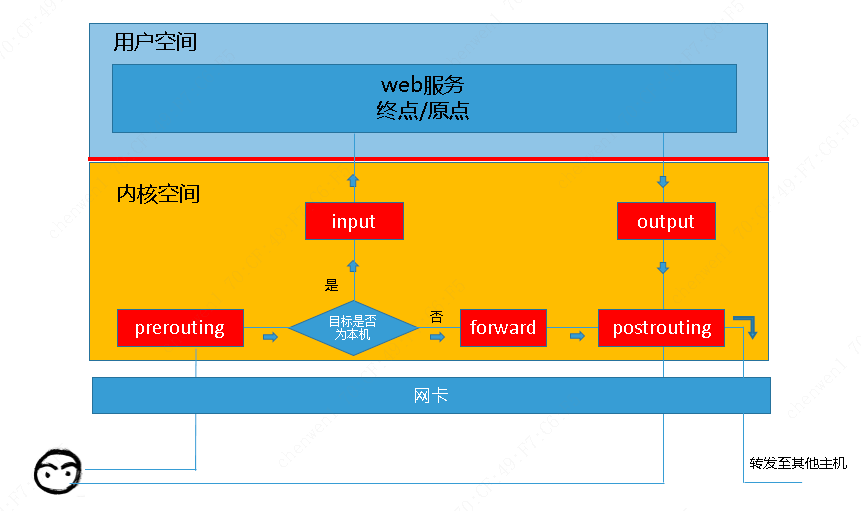

```
iptables -t 表名 <-A/I/D/R> 规则链名 [规则号] <-i/o 网卡名> -p 协议名 <-s 源IP/源子网> --sport 源端口 <-d 目标IP/目标子网> --dport 目标端口 -j 动作
```


### 选项

- `-A` 将一个规则添加到链末尾
- `-D` num 将指定的链中删除规则
- `-F` 将指定的链中删除所有规则
- `-I` num 将在指定链的指定编号位置插入一个规则(默认首行)
- `-L` 列出指定链中所有规则
- `-t` nat -L 列出所有NAT链中所有规则
- `-n` 用数字输出
- `-N` 建立用户定义链
- `-X` 删除用户定义链
- `-P` 修改链的默认设置，如将iptables -P INPUT DROP (将INPUT链设置为DROP)
- `-Z` 清空规则链中的数据包计算器和字节计数器

### 参数

- `--dport` 指定目标TCP/IP端口 如 `--dport 80`
- `--sport` 指定源TCP/IP端口 如 `–-sport 80`
- `-p tcp/icmp/udp` 指定协议为tcp/ICMP/UDP
- `-j ACCEPT/DROP/REJECT` 允许/丢弃/拒绝并向发出消息的计算机发一个消息
- `-j LOG` 在/var/log/messages中登记分组匹配的记录
- `-m mac --mac-source ADDRESS` 绑定MAC地址
- `-m limit --limit RATE[/second|/minute|/hour|/day]` 设置时间策列(默认是`3/hour`)
- `-m state --state INVALID|ESTABLISHED|NEW|RELATED`
- `-s 10.10.0.0`或`-s 10.10.0.0/16`指定源地址或地址段
- `-d 10.10.0.0`或`-d 10.10.0.0/16`指定目标地址或地址段
- `-s ! 10.10.0.0` 指定源地址以外的
- `-i 网络接口` 指定数据包进入本机的网络接口
- `-o 网络接口` 指定数据包离开本机的网络接口

### 从配置文件恢复
```
iptables-restore /etc/sysconfig/iptables
```

## 一. 典型配置


#### (1) 设定预设规则

```bash
# 请求接入包 :丢失
iptables -P INPUT DROP

# 响应数据包: 接受
iptables -P OUTPUT ACCEPT

# 转发数据包: 丢失
iptables -P FORWARD DROP
```

#### (2) 开启SSH端口: 22

```bash
# 允许所有IP进行SSH连接
iptables -A INPUT -p tcp --dport 22 -j ACCEPT

# 允许特定IP进行SSH连接
iptables -A INPUT -s 192.168.0.3 -p tcp --dport 22 -j ACCEPT

# 允许特定网段进行SSH连接
iptables -A INPUT -s 192.168.0.0/24 -p tcp --dport 22 -j ACCEPT

# 允许特定段IP进行SSH连接
iptables -A INPUT -m iprange --src-range 192.168.55.1-192.168.55.10 -p tcp --dport 22 -j ACCEPT

# 允许除某主机/网段以外的进行SSH连接
iptables -A INPUT -s ! 192.168.0.3 -p tcp --dport 22 -j ACCEPT
iptables -A INPUT -s ! 192.168.0.0/24 -p tcp --dport 22 -j ACCEPT

# OUTPUT设置为DROP时，需要添加以下对应项
iptables -A OUTPUT -p tcp --sport 22 -j ACCEPT 
iptables -A OUTPUT -d 192.168.0.3 -p tcp --sport 22 -j ACCEPT
iptables -A OUTPUT -d 192.168.0.0/24 -p tcp --sport 22 -j ACCEPT
```

#### (3) 允许ICMP流量进入(允许主机被Ping通)

- iptables

```bash
iptables -I INPUT -p icmp -j ACCEPT
```

- 内核

```x
echo 0 > /proc/sys/net/ipv4/icmp_echo_ignore_all
net.ipv4.icmp_echo_ignore_all=1

# 0:允许, 1:禁止
# 设置icmp_echo_ignore_all后，主机也无法ping通其他主机
```

#### (4) 允许所有已经建立的和相关的连接

```bash
iptables -A INPUT -m state --state ESTABLISHED,RELATED -j ACCEPT
```

#### (5) DORP非法连接

```bash
iptables -A INPUT   -m state --state INVALID -j DROP
iptables -A OUTPUT  -m state --state INVALID -j DROP
iptables -A FORWARD -m state --state INVALID -j DROP
```

#### (6) 允许loopback回环通信

```bash
iptables -A INPUT -s 127.0.0.1/32 -j ACCEPT
```
或
```bash
iptables -A INPUT -i lo -p all -j ACCEPT
```

## 二.  其他配置参考

#### (1) DNS: 53/UDP

```bash
iptables -A INPUT -p udp --dport 53 -j ACCEPT
```


#### (2) NTP: 123/UCP 

```bash
iptables -A INPUT -m state --state NEW -m udp -p udp --dport 123 -j ACCEPT
```

#### (3) 邮件服务

协议|端口|加密端口
--|--|--
`http`|80|443  
`smtp`|25|465  
`pop3`|110|995  
`imap`|143|993  


```bash
iptables -A INPUT -p tcp -m multiport --dports 25,80,110,143,443,465,993,995 -j ACCEPT
iptables -A INPUT -p udp -m multiport --dports 25,80,110,143,443,465,993,995 -j ACCEPT
```

#### (4) vsftpd

```bash
iptables -I INPUT -p tcp --dport 20:21 -j ACCEPT 
iptables -I INPUT -p tcp --dport 50000:60000 -j ACCEPT
```

#### (5) iscsi

```bash
iptables -I INPUT -s 10.10.10.2/24 -p tcp --dport 3260 -j ACCEPT
```

#### (6) it监控

```bash
iptables -A INPUT -s 10.150.36.71,10.150.36.72,10.150.36.120,10.150.36.122,10.150.36.1 -t tcp -m multiport --dport 1918,63358 -j ACCEPT
```

#### (7) 蓝鲸

```
-A INPUT -m iprange --src-range 10.150.45.209-10.150.45.222 -j ACCEPT
-A INPUT -s 127.0.0.1/32 -j ACCEP
-A INPUT -s 10.150.45.134 -j ACCEP
-A INPUT -s 10.150.32.243 -p tcp --dport 22 -j ACCEP
-A INPUT -p tcp --dport 2181 -j ACCEP
-A INPUT -p tcp --dport 48668 -j ACCEP
-A INPUT -p tcp --dport 58935 -j ACCEP
-A INPUT -m state --state RELATED,ESTABLISHED -j ACCEP
-A INPUT -s 10.150.36.71,10.150.36.72,10.150.36.120,10.150.36.122,10.150.36.1 -t tcp -m multiport --dports 1918,63358 -j ACCEPT

-A INPUT -p tcp -m multiport --dports 48668,58625,58725,58925,58930,10020,60020:60030 -j ACCEPT
-A INPUT -p udp -m multiport --dports 10020,10030,60020:60030 -j ACCEPT
```

```
/etc/hosts.allow

    sshd:10.150.45.222:allow
    sshd:10.150.45.134:allow
    sshd:10.150.45.214:allow
    sshd:10.150.45.219:allow
    sshd:10.150.45.220:allow
    sshd:all:deny
```

#### (8) nfs

```bash
firewall-cmd --add-service=nfs --permanent
firewall-cmd --add-service=mountd --permanent 
firewall-cmd --add-service=rpc-bind --permanent
firewall-cmd --reload


-A INPUT -p tcp -m multiport --dports 111,2049,20048 -j ACCEPT
-A INPUT -p udp -m multiport --dports 111,2049,20048 -j ACCEPT

```

#### (9) ???
```
-A INPUT -s 192.168.163.241 -t tcp -m multiport --dports 111,20048,2049,55118,36856 -j ACCEPT
-A INPUT -s 192.168.163.241 -t udp -m multiport --dports 111,20048,2049,36811,45992 -j ACCEPT
iptables-restore /etc/sysconfig/iptables
```


## 三. 注

### 注1：参考配置

```
cat /etc/sysconfig/iptables
```
```
# Generated by iptables-save v1.4.7 on Tue Dec 17 21:35:04 2019
*filter
:INPUT DROP [3:687]
:FORWARD DROP [0:0]
:OUTPUT ACCEPT [318:33304]
-A INPUT -p icmp -j ACCEPT 
-A INPUT -p tcp -m tcp --dport 22 -j ACCEPT 
-A INPUT -m state --state RELATED,ESTABLISHED -j ACCEPT 
-A INPUT -m state --state INVALID -j DROP 
-A INPUT -s 127.0.0.1/32 -j ACCEPT 
-A INPUT -p udp -m state --state NEW -m udp --dport 123 -j ACCEPT 
-A FORWARD -m state --state INVALID -j DROP 
-A OUTPUT -m state --state INVALID -j DROP 
COMMIT
# Completed on Tue Dec 17 21:35:04 2019
```

### 注2：`-m state --state`

- `NEW`  状态的数据包说明这个数据包是收到的第一个数据包。比如收到一个SYN数据包，它是连接的第一个数据包，就会匹配`NEW`状态。第一个包也可能不是SYN包，但它仍会被认为是`NEW`状态。

- `ESTABLISHED`  只要发送并接到应答，一个数据连接就从`NEW`变为`ESTABLISHED`,而且该状态会继续匹配这个连接后继数据包。

- `RELATED`  当一个连接和某个已处于`ESTABLISHED`状态的连接有关系时，就被认为是`RELATED`，也就是说，一个连接想要是`RELATED`的，首先要有个`ESTABLISHED`的连接，这个`ESTABLISHED`连接再产生一个主连接之外的连接，这个新的连接就是`RELATED`。

- `INVALID`  状态说明数据包不能被识别属于哪个连接或没有任何状态。


### 注3：`iptables`/`netfilter`的关系
`iptables`其实不是真正的防火墙，我们可以把它理解成一个客户端代理，用户通过`iptables`这个代理，将用户的安全设定执行到对应的"安全框架"中，这个"安全框架 防火墙，这个框架的名字叫`netfilter`。`netfilter`才是防火墙真正的安全框架（framework），netfilter位于内核空间。 iptables其实是一个命令行工具，位于用户空间，我们用这个工具操作真正的框架。


### 注4：规则和工作原理

- 规则: 其实就是网络管理员预定义的条件，规则一般的定义为"如果数据包头符合这样的条件，就这样处理这个数据包"

- 规则存储在内核空间的信息包过滤表中，这些规则分别指定了**源地址**、**目的地址**、**传输协议(如TCP、UDP、ICMP)** 和 **服务类型(如HTTP、FTP和SMTP)** 等

- 当数据包与规则匹配时，iptables就根据规则所定义的方法来处理这些数据包，如 **放行(accept)**、**拒绝(reject)** 和 **丢弃(drop)** 等。配置防火墙的主要工作就是 **添加、修改和删除** 这些规则。




某些场景中的报文流向：  
- 1>到本机某进程的报文：PREROUTING --> INPUT
- 2>由本机转发的报文：PREROUTING --> FORWARD --> POSTROUTING
- 3>由本机的某进程发出的报文：OUTPUT --> POSTROUTING

