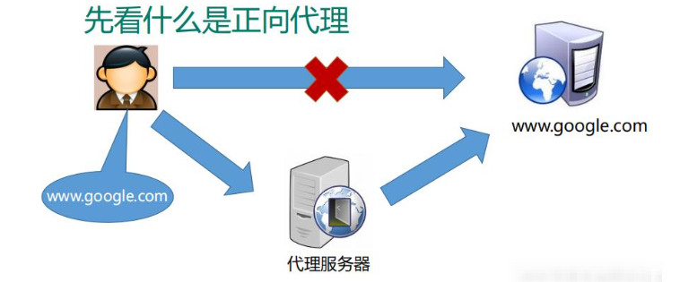
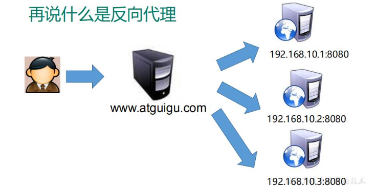
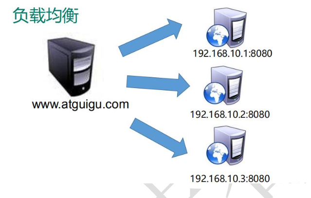
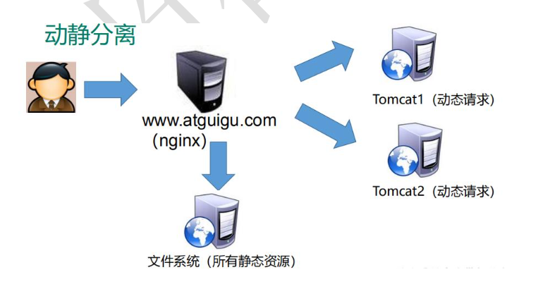

# About Nginx

> 入门级: [尚硅谷Nginx教程由浅入深](https://www.bilibili.com/video/BV1zJ411w7SV), 对Nginx有个基本的了解，包括编译安装、核心功能的简单实例等  
> Nginx参数讲解: [Nginx原理与实战](https://www.bilibili.com/video/BV1GB4y1P7e6) 从p17开始看配置文件讲解

## 1 nginx是什么，做什么事情

Nginx ("engine x")是一个高性能的HTTP和反向代理服务器，特点是**占有内存少，并发能力强**

Nginx**专为性能优化而开发，性能是其最重要的考量**，实现上**非常注重效率**，能经受高负载的考验，有报告表明能支持高达50000个并发连接数。(Baidu百科)

## 2 反向代理

> 正向代理隐藏客户端，反响代理隐藏服务端

## 3 负载均衡

客户端发送多个请求到服务器，服务器处理请求，有一些可能要与数据库进行交互，服务器处理完毕后，再将结果返回给客户端。

当业务量/访问量上升到一定的水平时, 服务器很容易出现性能问题。

处理方法有两种思路：

- 提高服务器配置

- 多配置几台服务器，将请求分发到不同的服务器 <== nginx负载均衡

## 4 动静分离

为了加快网站的解析速度，可以把动态页面和静态页面由不同的服务器来解析，加快解析速度。降低原来单个服务器的压力。

