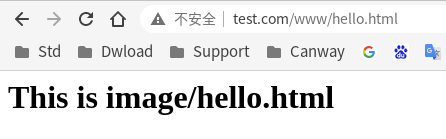
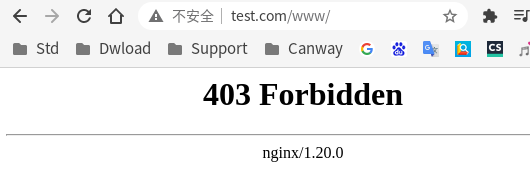
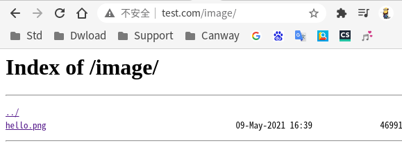

## 动静分离

Nginx 动静分离简单来说就是**把动态跟静态请求分开**，不能理解成只是单纯的把动态页面和静态页面物理分离。可以理解成**使用 Nginx 处理静态页面，Tomcat或其他web中间件处理动态页面**。

动静分离从目前实现角度来讲大致分为两种:

- 一种是纯粹**把静态文件独立成单独的域名**，放在独立的服务器上，也是目前主流推崇的方案;  
- 另外一种方法就是**动态跟静态文件混合在一起发布，通过 nginx 来分开**。通过 `location` 指定不同的后缀名实现不同的请求转发。

通过 `expires` 参数设置，可以设置浏览器缓存过期时间，减少与服务器之前的请求和流量。

具体 `expires` 定义：是给一个资源设定一个过期时间，也就是说无需去服务端验证，直接通过浏览器自身确认是否过期即可，所以不会产生额外的流量。此种方法**非常适合不经常变动的资源**, 如果经常更新的文件，不建议使用 `expires 来缓存。如果设置 `3d`，表示在这 3 天之内访问这个URL，发送一个请求，比对服务器该文件最后更新时间没有变化，则不会从服务器抓取，返回**状态码304**，如果有修改，则直接从服务器重新下载，返回**状态码200**。

## 动静分离实例

**动态部分**: 使用前文的 `tomcat` 配置即可

**静态部分**: 准备 /data 目录, `image` 存放图片 和 `www` 存放静态网页

```sh
/data:
html  image

./www:
hello.html

./image:
hello.png
```

**Nginx配置**

```
http {
    ...
    upstream tomserver {
        server 127.0.0.1:8080;
        server 127.0.0.1:8081;
    }

    server {
        listen       80;
        server_name  www.test.com;

        location /www/ {                   <=插入
            root /data;                    <=插入
        }                                  <=插入

        location /image/ {                 <=插入
            root /data;                    <=插入
            autoindex on;                  <=插入
        }                                  <=插入

        location ~ /edu/ {
            proxy_pass http://tomserver;
            root   html;
            index  index.html index.htm;
        }
...
```

**结果验证**

- `http://www.test.com/www/hello.html`



- `http://www.test.com/www/`



- `http://www.test.com/image/`

`location /image/`中添加了 `autoindex on`配置行, 因此访问 `http://www.test.com/image/` 时会显示目录



- `http://www.test.com/image/hello.png`

