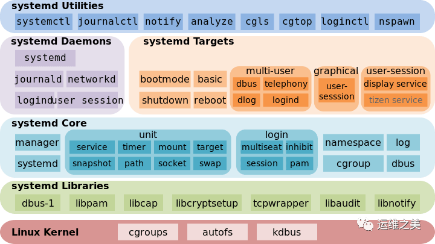

# systemd

> [https://cloud.tencent.com/developer/article/1516125](https://cloud.tencent.com/developer/article/1516125)

## systemd架构

Systemd 可以管理所有系统资源，不同的资源统称为 Unit（单位）。

在 Systemd 的生态圈中，Unit 文件统一了过去各种不同系统资源配置格式，例如服务的**启/停**、**定时任务**、**设备自动挂载**、**网络配置**、**虚拟内存配置**等。而 Systemd 通过不同的**文件后缀**来区分这些配置文件:

Systemd 支持的 12 种 Unit 文件类型

| Unit | 说明 |
| -- | :-- |
| `.automount` | 用于控制自动挂载文件系统，相当于 `SysV-init` 的 `autofs` 服务 |
| `.device` | 对于 `/dev` 目录下的设备，主要用于定义设备之间的依赖关系 |
| `.mount` | 定义系统结构层次中的一个挂载点，可以替代过去的 `/etc/fstab` 配置文件 |
| `.path` | 用于监控指定目录或文件的变化，并触发其它 Unit 运行 |
| `.scope` | 这种 Unit 文件不是用户创建的，而是 Systemd 运行时产生的，描述一些系统服务的分组信息 |
| `.service` | 封装守护进程的启动、停止、重启和重载操作，是最常见的一种 Unit 文件 |
| `.slice` | 用于表示一个 CGroup 的树，通常用户不会自己创建这样的 Unit 文件 |
| `.snapshot` | 用于表示一个由 systemctl snapshot 命令创建的 Systemd Units 运行状态快照 |
| `.socket` | 监控来自于系统或网络的数据消息，用于实现基于数据自动触发服务启动 |
| `.swap` | 定义一个用户做虚拟内存的交换分区 |
| `.target` | 用于对 Unit 文件进行**逻辑分组**，引导其它 Unit 的执行。它替代了 SysV-init 运行级别的作用，并提供更灵活的基于特定设备事件的启动方式 |
| `.timer` | 用于配置在特定时间触发的任务，替代了 Crontab 的功能 |