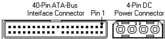

## CPU

```sh
cat /proc/cpuinfo
lscpu
sar -u 1 1
```

## 磁盘

```sh
lsblk
lsblk -d -n -o serial /dev/sda
smartctl -a /dev/sda
hdparam -i /dev/sda
udevadm info --query=all --name=/dev/sda
cat /proc/scsi/scsi
lshw -class disk   #< capabilities: 15000rpm ... 15000rpm表示转数
lsscsi
lsscsi -t -L 
cat /proc/partitio
sginfo -g /dev/sda  #< Rotational Rate: 转数
```

## 内存

```sh
cat /proc/meminfo
free -m
dmidecode -t 5
```

## 网卡

```sh
ethtool ens33
ethtool -i ens33
```


## 主板及其他

`dmidecode -t` :

```sh
DMI TYPES
       The SMBIOS specification defines the following DMI types:

       Type   Information
       --------------------------------------------
          0   BIOS
          1   System
          2   Baseboard
          3   Chassis
          4   Processor
          5   Memory Controller
          6   Memory Module
          7   Cache
          8   Port Connector
          9   System Slots
         10   On Board Devices
         11   OEM Strings
         12   System Configuration Options
         13   BIOS Language
         14   Group Associations
         15   System Event Log
         16   Physical Memory Array
         17   Memory Device
         18   32-bit Memory Error
         19   Memory Array Mapped Address
         20   Memory Device Mapped Address
         21   Built-in Pointing Device
         22   Portable Battery
         23   System Reset
         24   Hardware Security
         25   System Power Controls
         26   Voltage Probe
         27   Cooling Device
         28   Temperature Probe
         29   Electrical Current Probe
         30   Out-of-band Remote Access
         31   Boot Integrity Services
         32   System Boot
         33   64-bit Memory Error
         34   Management Device
         35   Management Device Component
         36   Management Device Threshold Data
         37   Memory Channel
         38   IPMI Device
         39   Power Supply
         40   Additional Information
         41   Onboard Devices Extended Information
         42   Management Controller Host Interface

       Keyword     Types
       ------------------------------
       bios        0, 13
       system      1, 12, 15, 23, 32
       baseboard   2, 10, 41
       chassis     3
       processor   4
       memory      5, 6, 16, 17
       cache       7
       connector   8
       slot        9
```


## 附：磁盘接口（总线）类型

* `ATA`（Advanced Technology Attachment）

`ATA` 硬盘是传统的桌面级硬盘，通常也被称为`IDE` (Integrated Drive Electronics) 硬盘，这是一种 **并行总线硬盘**，转速为7200RPM。



* `SATA`（Serial ATA）

`SATA` 口的硬盘又叫 **串口硬盘**，从名称上我们就可以看出来这种类型的硬盘是ATA硬盘的升级版（可能 不太严谨）！这种硬盘采用点对点的连接方式，支持热插拔。转速为7200RPM，主要容量有750GB、1TB、2TB、4TB等。目前被广泛应用家用PC、某些服务器存储。 


* `SCSI`（Small Computer System Interface）

`SCSI` 直译为 **小型计算机系统专用接口**。它是一种连接主机和外围设备的接口，支持包括硬盘、光驱及扫描仪在内的多种设备。`SCSI` 总线是一种 **并行总线**，常用于企业级存储领域。其优点是适应面广，性能高，硬盘转速快（15000RPM），缓存容量大，CPU占用率低，扩展性远优于IDE硬盘，并且 **支持热插拔**。缺点是价格昂贵，安装复杂。接口速率目前已经发展到320MB/s，基本已经达到极限。将来有被其串行版本SAS取而代之的趋势。


* `SAS`（Serial Attached SCSI） 

`SAS` 跟 `SATA` 硬盘有点类似，都是采用 **串行技术** 以获得更高的传输速度。`SAS` 是一种 **全双工、点对点、双端口** 的接口。主要用于高性能企业存储领域。这种类型的硬盘转速为15000RPM。

SAS 的接口技术可以 **向下兼容SATA** 。具体来说，二者的 **兼容性主要体现在物理层和协议层的兼容**。

在物理层，`SAS` 接口和 `SATA` 接口完全兼容，`SATA` 硬盘可以直接使用在 `SAS` 的环境中

从接口标准上而言，`SATA` 是 `SAS` 的一个子标准，因此 `SAS` 控制器可以直接操控 `SATA` 硬盘，但是 `SAS` 却不能直接使用在 `SATA` 的环境中，`SATA` 控制器并不能对 `SAS` 硬盘进行控制。


* `FC`（Fiber Channel） 

`FC` 即为光纤通道技术，最早应用于SAN （存储局域网络）。FC接口是光纤对接的一种接口标准形式，其他的常见类型为：ST、SC、LC、MTRJ等。FC-AL支持全双工工作方式，其利用类似SATA/SAS所用的4芯连接，提供一种单环拓扑结构，一个控制器能访问126个设备。这是一种串行设备，转速高达15000RPM，常见容量为300GB。

