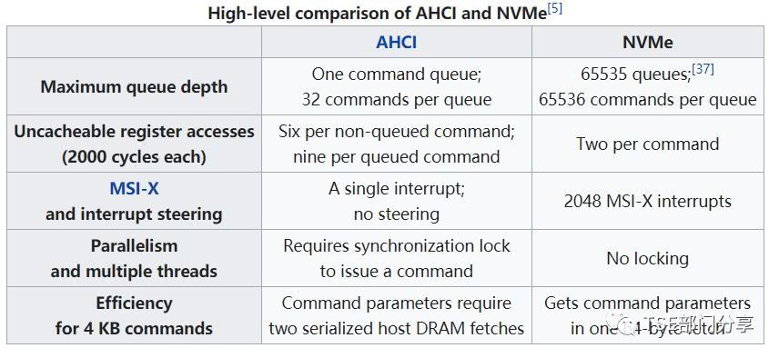

## 磁盘性能指标

**IOPS**: *每秒读/写次数*, 单位为 *次*(计数)。存储设备的底层驱动类型决定了不同的IOPS。

**吞吐量**: *每秒的读写数据量*, 单位为 `MB/s`。

**时延**: I/O 操作的 *发送时间到接收确认* 所经过的时间, 单位为 *秒*。

## fio

| 参数名    | 说明 | 样例 |
|  -- | -- | -- |
| `numjobs`         | 测试进程数量 | 16 |
| `bs`       | 每次请求的块大小: 4k, 8k, 16k等 | 4k |
| `ioengine` | I/O 引擎: Linux原生异步I/O引擎 | libaio |
| `iodepth`  | 请求的 I/O 队列深度 | 32 |
| `direct`   | 指定 direct 模式: <br>True(1): 表示指定 O_DIRECT 标识符, 忽略 I/O 缓存, 数据直写(默认)<br>False(0): 表示不指定 O_DIRECT 标识符 | 1 |
| `rw`         | 指定读写模式: <br>顺序读(read), 顺序写(write), 随机读(randread), 随机写(randwrite), <br>混合随机读写(randrw)和混合顺序读写(rw, readwrite)。 | read |
| `time_based` | 指定采用时间模式。无需设置该参数值, 只要 FIO 基于时间来运行。 | N/A |
| `runtime`    | 指定测试时长, 即 FIO 运行时长. | 300 |
| `refill_buffers` | FIO 将在每次提交时重新填充 I/O 缓冲区。默认设置是仅在初始时填充并重用该数据 | N/A |
| `norandommap`    | 在进行随机 I/O 时, FIO 将覆盖文件的每个块。若给出此参数, 则将选择新的偏移量而不查看 I/O 历史记录 | N/A |
| `randrepeat`     | 随机序列是否可重复, True(1)表示随机序列可重复, False(0)表示随机序列不可重复。默认为 True(1) | 0 |
| `group_reporting` | 多个 job 并发时, 打印整个 group 的统计值 | N/A |
| `name`            | job 的名称 | fio-read |
| `size`            | I/O 测试的寻址空: 不指定的时候, 会全盘测试; 如果是文件测试, 不指定大小则会报错 | 100G |
| `filename`        | 测试对象, 即待测试的磁盘设备名称。 | /dev/sdb |
| `thread` | 默认使用fork创建job, 指定thread后使用`pthread_create`创建(POSIX Threads' function) | |
| `percentage_random` | 指定随机读/写的占比 | 100,0 |


### 裸盘iops测试

* 随机写IOPS

```sh
fio -numjobs=16 -bs=4k -ioengine=libaio -iodepth=32 -direct=1 -rw=randwrite -time_based -runtime=300  -refill_buffers -norandommap -randrepeat=0 -group_reporting -name=fio-randwrite-iops -filename=/dev/vdb
```

* 随机读IOPS

```sh
fio -numjobs=16 -bs=4k -ioengine=libaio -iodepth=32 -direct=1 -rw=randread -time_based -runtime=300  -refill_buffers -norandommap -randrepeat=0 -group_reporting -name=fio-randread-iops -filename=/dev/vdb
```

### 裸盘带宽测试(顺序读写)

* 顺序写带宽

```sh
fio --numjobs=16 -bs=128k -ioengine=libaio -iodepth=32 -direct=1 -rw=write -time_based -runtime=300  -refill_buffers -norandommap -randrepeat=0 -group_reporting -name=fio-write-throughput -filename=/dev/vdb
```

* 顺序读带宽

```sh
fio --numjobs=16 -bs=128k -ioengine=libaio -iodepth=32 -direct=1 -rw=read -time_based -runtime=300  -refill_buffers -norandommap -randrepeat=0 -group_reporting -name=fio-read-throughput -filename=/dev/vdb
```

### 裸盘延迟

* 随机写延迟

```sh
fio --numjobs=16 -bs=4k -ioengine=libaio -iodepth=1 -direct=1 -rw=randwrite -time_based -runtime=300  -refill_buffers -norandommap -randrepeat=0 -group_reporting -name=fio-randwrite-lat -filename=/dev/vdb
```

* 随机读延迟 

```sh
fio --numjobs=16 -bs=4k -ioengine=libaio -iodepth=1 -direct=1 -rw=randread -time_based -runtime=300  -refill_buffers -norandommap -randrepeat=0 -group_reporting -name=fio-randread-lat -filename=/dev/vdb
```

### 非裸盘测试--指定文件大小和文件名

```sh
-size=10G -filename=/file/path

```

### 关于 `iodepth`



AHCI与NVMe两种接口之间的对比表明: 

* AHCI接口只拥有一个队列, 每个队列深度最大为32；
* NVMe接口最高拥有64K个队列, 每个队列深度最大为64K；

所以使用SATA/SAS接口的硬盘, 测试硬盘性能时, 队列深度建议最大设为32, 再高, 只会降低测试的性能值；若使用NVMe硬盘, 深度可以适当的增加, 这取决于硬盘本身的性能。

fio -ioengine=psync -bs=32k -fdatasync=1 -thread -rw=randrw  -size=10G -filename=fio_randread_write_test.txt -name='fio mixed randread and sequential write test' -iodepth=4 -runtime=60 -numjobs=4 -group_reporting 


## dd

* 写

```sh
dd if=/dev/zero of=/mnt/test/testfile bs=4k count=26214400 oflag=direct # 100G
```

* 读

```sh
dd if=/root/testfile of=/dev/null bs=4k count=26214400 iflag=direct # 100G
```