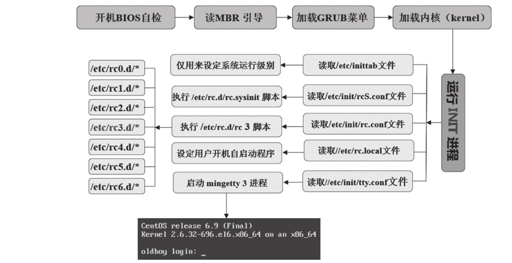
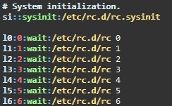
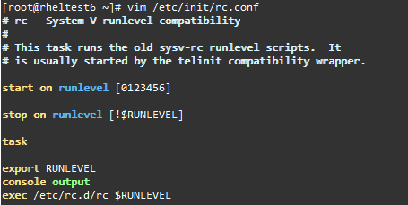
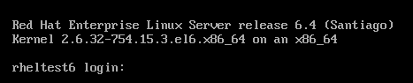
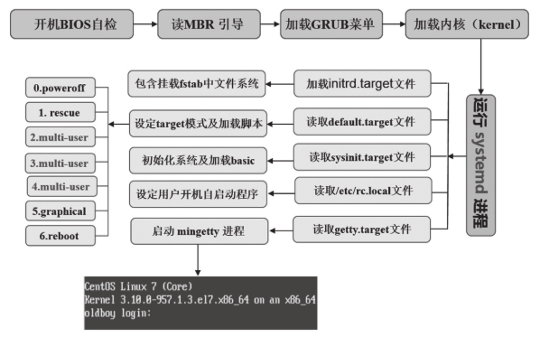
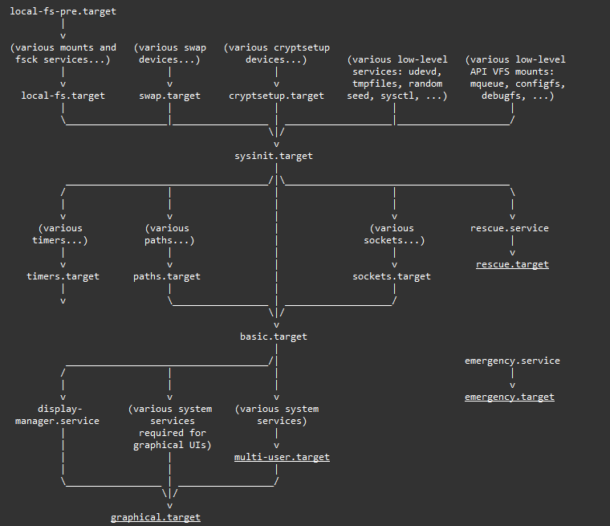
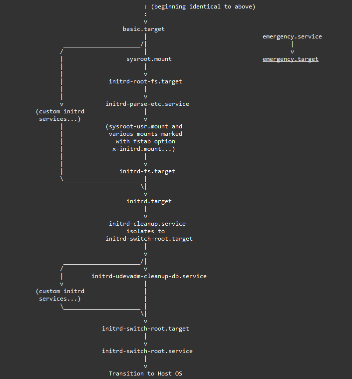
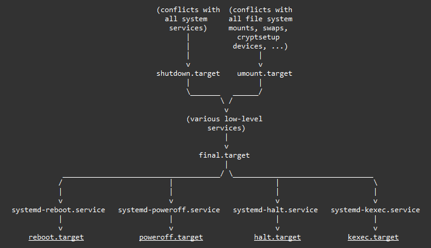

# <center>系统启动过程 </center>

<br>

# Content

* [CentOS6](#CentOS6)
* [CentOS7](#CentOS7)
    * [systemd](#systemd)
<br>

## CentOS6

<center>



</center>

### 1. 开机自检

对硬件进行检查，正确检查以后进入下一步

### 2. 读取MBR

**主引导记录**，共512bytes(**0柱面、0磁道、1扇区前512字节**)

- 前446字节为**引导记录区**，记录了哪些活动分区，用于找到活动的分区，并将活动分区的引导记录写入内存  
- 后66字节记录**磁盘的分区信息**，前64字节记录磁盘分区表信息，后2字节是分区的结束标志  

### 3. 加载GRUB菜单

`bootloader`被运行以后，读取`/etc/grub.conf` ( `/boot/grub/menu.lst`, `/boot/grub/grub.conf` )


```x
# grub.conf generated by anaconda
#
# Note that you do not have to rerun grub after making changes to this file
# NOTICE:  You have a /boot partition.  This means that
#          all kernel and initrd paths are relative to /boot/, eg.
#          root (hd0,0)
#          kernel /vmlinuz-version ro root=/dev/mapper/vg_rheltest6-lv_root
#          initrd /initrd-[generic-]version.img
#boot=/dev/sda
default=0                                  #默认情况下如何加载系统，0表示加载菜单中对应的第一个名字
timeout=5                                  #表示多少秒后开始加载默认系统
splashimage=(hd0,0)/grub/splash.xpm.gz     #启动时显示的背景图片，(hd0,0)表示/boot分区
hiddenmenu                                 #启动时默认会隐藏菜单信息，按默认设置启动系统；除非用户按键干预
#password [-md5|-encrypted] STRING         #此项默认没有。编辑grub菜单需要认证
title Red Hat Enterprise Linux Server (2.6.32-754.15.3.el6.x86_64)    #系统对应的名称，可按需修改
        root (hd0,0)                                                  #引导内核文件和内核所需驱动文件所在的分区，(hd0,0)表示/boot分区。hd0表示计算机的第一块磁盘，逗号后面的0表示第一个分区。
        kernel /vmlinuz-2.6.32-754.15.3.el6.x86_64 ro root=/dev/mapper/vg_rheltest6-lv_root rd_LVM_LV=vg_rheltest6/lv_root rd_NO_LUKS LANG=en_US.UTF-8 rd_NO_MD SYSFONT=latarcyrheb-sun16 crashkernel=auto  KEYBOARDTYPE=pc KEYTABLE=us rd_LVM_LV=vg_rheltest6/lv_swap rd_NO_DM rhgb quiet
                                                                      #位于boot分区的内核文件，以及一些可选内核参数
                                                                      #/vmlinuz-2.6.32-754.15.3.el6.x86_64为内核文件(/boot下)；root=/dev/mapper/vg_rheltest6-lv_root 表示根对应的设备信息(有时候也写成UUID)
        initrd /initramfs-2.6.32-754.15.3.el6.x86_64.img              #临时的初始根文件系统，init程序也在其中；内核启动所需的驱动文件，存在于boot区


# Linux内核在初始化之后会执行init进程，而init进程会挂载我们的根文件系统，但由于init程序也是在根文件系统上的，所以这就有了悖论。
# 2.6以前 initrd.img，2.6以后initramfs.img ；
# initramfs 的工作方式：系统启动的时候加载内核和 initramfs 到内存执行，内核初始化之后，切换到用户态执行 initramfs 的程序/脚本，加载需要的驱动模块、必要配置等，然后加载 rootfs 切换到真正的 rootfs 上去执行后续的 init 过程
```

### 4. 加载内核

根据`GRUB`设定的路径读取内核映像，运行解压缩，解压完成后输出 ***OK，booting the kernel*** 信息。
	
其实是根据`grub.conf`中的`kernel /vmlinuz-2.6.32-754.15.3.el6.x86_64 ro root=/dev/mapper/vg_rheltest6-lv_root xxxx`的设定**加载内核及相关参数**，同时还会**加载内核所需要的驱动程序文件**(`initrd /initramfs-xxxxxxx.img`)，进而挂载并读取根分区的信息，加载操作系统

### 5. 启动init进程

内核初始化以后，`/sbin/init`进程首先启动，其PID为1

### 6. init进程读取/etc/inittab，设定运行级别

init启动以后立刻读取`/etc/inittab`设定的系统的运行级别: `id:3:initdefault:`，从而影响后面运行哪部分的文件

### 7. 初始化系统、加载内核模块

#### 7.1. init进程读取/etc/init/rcS.conf，初始化系统

关于`/etc/rc.d/rc.sysinit`:
	
- CentOS6以前，init进程根据`/etc/inittab`中的设置加载`/etc/rc.d/rc.sysinit`，进行初始化。系统设置包括但不限于：**设置主机名**、**设置欢迎信息**、**激活udev和selinux**、**加载`/etc/fstab`并挂载**、**设置时间**、**读取`/etc/sysctl.conf`设置内核参数**、**激活LVM及software raid设备**、**加载额外设备的驱动程序**、**各种清理动作**（如清理日志）等

- CentOS6中，init进程不再通过读取`/etc/inittab`而加载`/etc/rc.d/rc.sysinit`，而是读取`/etc/init/rcS.conf`文件加载`/etc/rc.d/rc.sysinit`，然后对系统进行初始化系统设置

#### 7.2. init进程加载内核相关模块

CentOS6以前，init进程读取`/etc/modules.conf`文件或`/etc/modules.d`目录下的文件加载内核模块(centos6中已经没有这两个)

CentOS6，加载`/etc/sysconfig/modules/`下的内核模块

### 8. init进程运行对应运行级别的开机脚本

运行以下目录下的脚本：

```sh
/etc/rc0.d/ ~ /etc/rc6.d   #指向/etc/rc.d/rc0.d/ -- /etc/rc.d/rc6.d
```

CentOS6，init 进程不再通过读取`/etc/inittab`加载运行级别对应的脚本了，而是读取/etc/init/rc.conf 加载指定运行级别对应目录的脚本
	
- centos 5.5 通过`/etc/inittab`调起`/etc/rc.d/rc`，进而执行`/etc/rcN.d/*`

    

- centos 6中，`/etc/init/rc.conf`最后一行会调起`/etc/rc.d/rc $RUNLEVEL`。由`/etc/rc.d/rc`执行一部分设置，并调起`/etc/rcN.d/`下的脚本

    


### 9. 加载/etc/rc.local

```sh
/etc/rc.local #指向/etc/rc.d/rc.local
```

系统做好一切初始化工作以后，开始自动执行`/etc/rc.local`文件记录的开机执行命令

### 10. 启动mingetty，进入登录前状态

系统读取`/etc/init/tty.conf`  (早期也是读取 `/etc/inittab` 进行设置的)




<br>
<br>


## CentOS7

<Center>



</Center>

### 1. 启动进程变化

CentOS7 和 CentOS6 的启动流程绝大部分还是相同的，但也有一些小区别。例如，CentOS6 下第一个启动的 init 进程被改为了 systemd（并行启动模式）

**CentOS7 是并行启动，各个unit之间并无明显的先后顺序**

### 2. 文件的变化

名称: grub => grub2

|centos6 | centos7|
|---     | ---    |
|/etc/grub.conf	    |/etc/grub2.cfg|
|/boot/grub/menu.lst	|/boot/grub2/grub.cfg|
|/boot/grub/grub.conf| 	|
| 	| /etc/default/grub|
|	| /etc/grub.d/|

### 3. grub2启动引导阶段

|文件|作用|
|--- | --- |
boot.img|唯一作用是在系统启动时装载core.img|
core.img|grub2的核心映像文件|
*.mod	|可动态加载的模块|
grub.cfg|核心配置文件|

### 4. 加载内核和initramfs

从磁盘加载到ram。

`initramfs`是cpio的归档文件，**包含必要的kernel模块以及初始化脚本等**

### 5. 启动systemd进程

从initramfs启动systemd的工作副本（`/sbin/systemd`, pid=0）

### 6. 加载initrd.target(`/usr/lib/systemd/system/initrd.target`)所有单元，包括/etc/fstab

完成以后，控制权会移交给root文件系统的systemd实例

### 7. 加载default.target，设定运行级别

### 8. 加载sysinit.target，初始化系统及加载basic.target

### 9. 启动对应运行级别(如multi-user.target)下的服务程序

```sh
/etc/systemd/system/
/usr/lib/systemd/system/
```

### 10. 读取并执行/etc/rc.d/rc.local

### 11. 加载getty.target

### #12. 启动graphical所需服务（图形桌面）


### systemd

```
man bootup           #systemd启动
man systemd.special  #查看各个systemd的unit含义
```

<br>

**SYSTEM MANAGER BOOTUP**  
&emsp;The following chart is a structural overview of these well-known units and their position in the boot-up logic. The arrows describe which units are pulled in and ordered before which other units. Units near the top are started before units nearer to the bottom of the chart.




**BOOTUP IN THE INITIAL RAM DISK (INITRD)**  
&emsp;The default target in the initrd is initrd.target. The bootup process begins identical to the system manager bootup (see above) until it reaches basic.target. From there, systemd approaches the special target initrd.target.   

&emsp;If the root device can be mounted at /sysroot, the sysroot.mount unit becomes active and initrd-root-fs.target is reached.   
&emsp;The service initrd-parse-etc.service scans /sysroot/etc/fstab for a possible /usr mount point and additional entries marked with the x-initrd.mount option. All entries found are mounted below /sysroot, and initrd-fs.target is reached.   
&emsp;The service initrd-cleanup.service isolates to the initrd-switch-root.target, where cleanup services can run. As the very last step, the initrd-switch-root.service is activated, which will cause the system to switch its root to /sysroot.



**SYSTEM MANAGER SHUTDOWN**  
&emsp;System shutdown with systemd also consists of various target units with some minimal ordering structure applied



