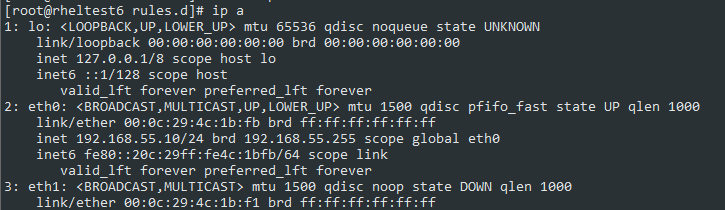
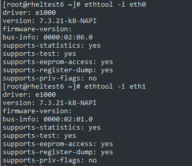
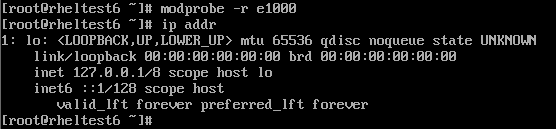
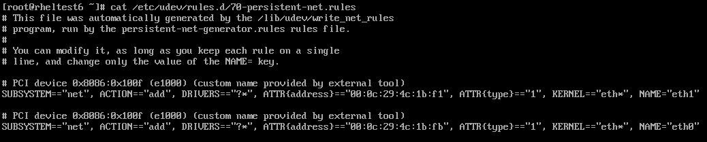
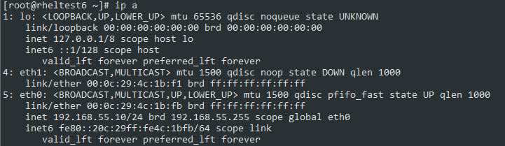
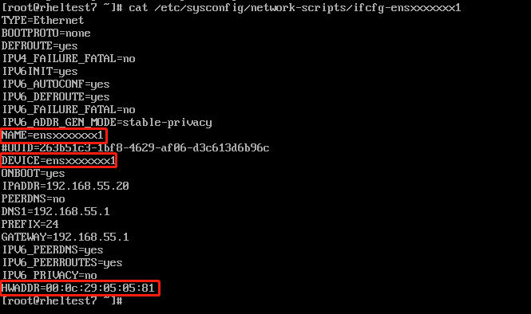
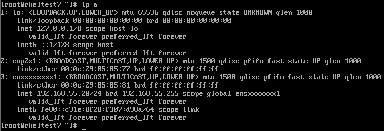

## 1 RHEL/CentOS 6

本次实验目的及预期：当前使用的是eth0，MAC地址00:0c:29:4c:1b:f1。通过将eth0和eth1网卡名互换，由MAC地址为00:0c:29:4c:1b:fb的网卡提供服务，并保证网卡名依旧为eth0。

系统版本：Redhat Enterprise Linux 6.4

注：如果要达到自动起ip，需要将配置文件ifcfg-eth0的MAC地址配置行注释掉或者提前替换成新的MAC地址





### 1.1 查看网卡驱动

通过ethtool查看网卡的驱动：检查driver字段的值，此处为e1000

```bash
ethtool -i eth0
ethtool -i eth1
```





### 1.2 卸载网卡驱动

通过modprobe卸载驱动

```bash
modprobe -r e1000
```





### 1.3 修改配置文件

需要改动的文件为`/etc/udev/rules.d/70-persistent-net.rules`

```bash
cp /etc/udev/rules.d/70-persistent-net.rules /root/70-persistent-net.rules.bak      #备份
sed -i 's/eth0/eth0_temp/' /etc/udev/rules.d/70-persistent-net.rules                #先将eth0改为其他的名称，后面再改为eth1
sed -i 's/eth1/eth0/' /etc/udev/rules.d/70-persistent-net.rules                     #将eth1改为eth0
sed -i 's/eth0_temp/eth1/' /etc/udev/rules.d/70-persistent-net.rules                #将原eth0改为eth1
cat /etc/udev/rules.d/70-persistent-net.rules                                       #检查配置文件修改是否如预期
```





### 1.4 加载网卡驱动

```bash
modprobe e1000
```

### 1.5 验证网卡名是否已经修改

可以看见，网卡名已经修改，由MAC地址为00:0c:29:4c:1b:fb的网卡提供服务





## 2 RHEL/CentOS 7

RHEL 7中，systemd采用新的命名规则，先来理解rename步骤：

### step 1

`/usr/lib/udev/rules.d/60-net.rules` 文件中的规则会让`udev helper utility` (即`/lib/udev/rename_device`) 检查所有 `/etc/sysconfig/network-scripts/ifcfg-suffix` 文件。  

如果发现包含 `HWADDR` 条目的ifcfg文件与某个接口的 MAC 地址匹配，它会将该接口重命名为 ifcfg 文件中由 DEVICE配置的名称。

> 注，DEVICE设置的名称应该与文件名相对应。即配置文件`ifcfg-suffix`中，`DEVICE=suffix`

### step 2

`/usr/lib/udev/rules.d/71-biosdevname.rules`

对于 **step 1** 中没有被rename的接口，当安装了 `biosdevname`，并且内核参数未设置`biosdevname=0`时，`/usr/lib/udev/rules.d/71-biosdevname.rules`(没有安装biosdevname，就没有这个文件) 中的规则会让 biosdevname 根据其命名策略重命名该接口。

### step 3

`/lib/udev/rules.d/75-net-description.rules` 中的规则让 udev 通过检查网络接口设备，填写内部 udev 设备属性值 `ID_NET_NAME_ONBOARD`、`ID_NET_NAME_SLOT`、`ID_NET_NAME_PATH`。

注：有些设备属性可能处于未定义状态undefined

### step 4

`/usr/lib/udev/rules.d/80-net-name-slot.rules` 中的规则让 udev 重命名step1和step2中未命名的网卡。

内核参数未设置`net.ifname=0`时，按照文件中设置的规则顺序命名。如果这些属性值未设置，则网卡无法被rename。


默认的规则顺序如下：

> Naming Schemes Hierarchy(命名方式层级，可在/usr/lib/udev/rules.d/80-net-name-slot.rules中设置)  
> * `ID_NET_NAME_ONBOARD`	#BIOS provided index numbers for on-board devices (example: eno1)  
> * `ID_NET_NAME_SLOT`  #BIOS provided PCI Express hotplug slot index numbers(example: ens1)  
> * `ID_NET_NAME_PATH`	#physical location of the connector of the hardware (example: enp2s0)  
> * `ID_NET_NAME_MAC`		#整个MAC地址的命名方式(example: enx000c29050577)  
> * 传统的不可预测的内核命名方案 #其他都失效以后(example: eth0)  

那么，当我们要自定义自己的网卡名市，直接编辑/etc/sysconfig/network-scripts/ifcfg-suffix文件即可，suffix、DEVICE、MAC相应改成自己需要的

如图，现在想要一个名称为 *ensxxxxxxx1* 的网卡，对应的MAC地址为`00:0c:29:05:05:81`





重启以后，即可设定。





一般的，会出现以下几种网卡名(`eth0`,`ens33`,`eno000009`)，可以通过`/etc/default/grub` 或 `/etc/sysconfig/grub` 中修改 `GRUB_CMDLINE_LINUX` 行修改，重启后生效，其对应关系如下：

```
net.ifnames=0 ==>
biosdevname=0 ==>
net.ifnames=0 biosdevname=0 ==> eth0  
net.ifnames=1 biosdevname=0 ==> ens192  
net.ifnames=0 biosdevname=1 ==> 
net.ifnames=1 biosdevname=1 ==>
```