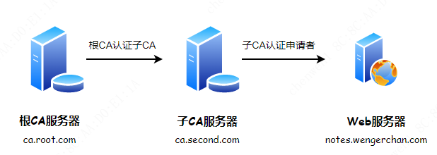

# 自签名证书

步骤:


```text
(1)生成CA根证书
(2)生成服务器证书请求
(3)通过CA根证书和服务器证书请求生成服务器证书
```

> 1. 服务器证书生成后，便可以在web服务器上进行配置
> 2. 为HTTPS准备的证书需要注意，创建的签名请求的`CN必须与域名完全一致`，否则无法通过浏览器验证


## 1 CA证书 - 搭建CA服务器

> [https://www.jianshu.com/p/9142d9d186e2](https://www.jianshu.com/p/9142d9d186e2)

步骤:

* 1.根CA生成自己的私钥，生成自签名证书
* 2.(可选)子CA生成自己的私钥、证书申请文件，将证书申请文件发送给根CA请求根CA签署证书。(此时子CA的身份为申请者)
* 3.(可选)子CA拿到根CA签署的证书文件，修改配置文件后，可以向其他申请者签署证书(此时子CA为签署者)
* 4.Web服务器，生成自己的私钥、证书申请文件，将证书申请根文件发送给子CA请求子CA签署证书。


### 1.1 架构: 包含子CA




根CA进行签署自证证书; 子CA向根CA申请证书; 根CA签署证书后子CA就可以向其他申请者发放证书。

此时的子CA服务器相对于根服务器来说是申请者，相对于web服务器申请者是签署者，所以子CA是两个身份，既是申请者又是签署者。


### 1.2 相关配置文件 /etc/pki/tls/openssl.cnf

```sh
~] cat /etc/pki/tls/openssl.cnf

####################################################################
[ ca ]
default_ca      = CA_default            # 默认的CA配置；CA_default指向下面配置块

####################################################################
[ CA_default ]

dir             = /etc/pki/CA           # CA的默认工作目录
certs           = $dir/certs            # 认证证书的目录
crl_dir         = $dir/crl              # 证书吊销列表的路径
database        = $dir/index.txt        # 数据库的索引文件

new_certs_dir   = $dir/newcerts         # 新颁发证书的默认路径

certificate     = $dir/cacert.pem       # 此服务认证证书，如果此服务器为根CA那么这里为自颁发证书
serial          = $dir/serial           # 下一个证书的证书编号
crlnumber       = $dir/crlnumber        # 下一个吊销的证书编号

crl             = $dir/crl.pem          # The current CRL
private_key     = $dir/private/cakey.pem # CA的私钥
RANDFILE        = $dir/private/.rand    # 随机数文件

x509_extensions = usr_cert              # The extentions to add to the cert

name_opt        = ca_default            # 命名方式，以ca_default定义为准
cert_opt        = ca_default            # 证书参数，以ca_default定义为准

default_days    = 365                   # 证书默认有效期
default_crl_days= 30                    # CRl的有效期
default_md      = sha256                # 加密算法
preserve        = no                    # keep passed DN ordering

policy          = policy_match          #policy_match策略生效

# For the CA policy
[ policy_match ]
countryName             = match         #国家；match表示申请者的申请信息必须与此一致
stateOrProvinceName     = match         #州、省
organizationName        = match         #组织名、公司名
organizationalUnitName  = optional      #部门名称；optional表示申请者可以的信息与此可以不一致
commonName              = supplied
emailAddress            = optional

# For the 'anything' policy
# At this point in time, you must list all acceptable 'object'
# types.
[ policy_anything ]                     #由于定义了policy_match策略生效，所以此策略暂未生效
countryName             = optional
stateOrProvinceName     = optional
localityName            = optional
organizationName        = optional
organizationalUnitName  = optional
commonName              = supplied
emailAddress            = optional
...
```


### 1.3 目录结构图


* 根CA服务器：因为只有CA服务器的角色，所以用到的目录只有 `/etc/pki/CA`
* Web服务器：只是证书申请者的角色，所以用到的目录只有 `/etc/pki/tls`
* 子CA服务器：因为既充当证书签署者，又充当证书申请者的角色。所以两个目录都有用到。


#### 1.3.1 CA服务器目录

```sh
~] tree /etc/pki/CA
/etc/pki/CA/
├── certs    # 已签署证书(.crt) + 未签署证书(.csr)
├── crl      # 证书吊销列表的路径
├── newcerts # 新颁发证书的默认路径
└── private  # 密钥存放
```


#### 1.3.2 客户端目录

```sh
~] tree /etc/pki/tls/
/etc/pki/tls/
├── certs    # 已签署证书(.crt) + 未签署证书(.csr)
├── misc
├── openssl.cnf
└── private  # 密钥存放
```


### 1.4 搭建CA


#### 1.4.1 根CA

* 创建根CA相关文件

    ```sh
    mkdir -p /etc/pki/CA/{certs,crl,newcerts,private}
    touch /etc/pki/CA/index.txt   # 生成证书索引数据库文件
    echo 01 > /etc/pki/CA/serial  # 指定第一个颁发证书的序列号
    ```

* 创建根CA密钥

    在根CA服务器上创建密钥, 密钥的位置必须为 `/etc/pki/CA/private/cakey.pem` (与`openssl.cnf`文件指定的路径匹配即可)

    ```sh
    ( umask 066; openssl genrsa -out /etc/pki/CA/private/cakey.pem 2048)
    ```

* 创建根CA自签名证书

    CA证书需要放 `/etc/pki/CA/cacert.pem` (与`openssl.cnf`文件指定的路径匹配即可)

    ```sh
    openssl req -new -x509 -key /etc/pki/CA/private/cakey.pem -days 36500 -out /etc/pki/CA/cacert.pem
    #  -new      : 生成新证书签署请求
    #  -x509     : 专用于CA生成自签证书
    #  -key      : 生成请求时用到的私钥文件
    #  -days N   ：证书的有效期限
    #  -out PATH : 证书的保存路径


    ~] openssl req -new -x509 -key /etc/pki/CA/private/cakey.pem -days 36500 -out /etc/pki/CA/cacert.pem
    You are about to be asked to enter information that will be incorporated
    into your certificate request.
    What you are about to enter is what is called a Distinguished Name or a DN.
    There are quite a few fields but you can leave some blank
    For some fields there will be a default value,
    If you enter '.', the field will be left blank.
    -----
    Country Name (2 letter code) [XX]:CN                          # <= CN
    State or Province Name (full name) []:GuangDong               # <= GuangDong
    Locality Name (eg, city) [Default City]:ShenZhen              # <= ShenZhen
    Organization Name (eg, company) [Default Company Ltd]:XTPTS   # <= XTPTS
    Organizational Unit Name (eg, section) []:
    Common Name (eg, your name or your server s hostname) []:ca.root.com  # <= ca.root.com
    Email Address []:
    ```

    `/etc/pki/CA/cacert.pem` 就是生成的自签名证书文件，导入到 Windows 中安装此证书到 "受信任的根证书颁发机构"。

#### 1.4.2 (可选)子CA

* 创建子CA密钥

    ```sh
    (umask 066; openssl genrsa -out /etc/pki/tls/private/ca.second.com.key 2048)
    ```

* 创建子CA证书请求文件

    ```sh
    ~] openssl req -new -key /etc/pki/tls/private/ca.second.com.key -out /etc/pki/tls/ca.second.com.csr

    You are about to be asked to enter information that will be incorporated
    into your certificate request.
    What you are about to enter is what is called a Distinguished Name or a DN.
    There are quite a few fields but you can leave some blank
    For some fields there will be a default value,
    If you enter '.', the field will be left blank.
    -----
    Country Name (2 letter code) [XX]:CN                          # <= CN
    State or Province Name (full name) []:GuangDong               # <= GuangDong
    Locality Name (eg, city) [Default City]:ShenZhen              # <= ShenZhen
    Organization Name (eg, company) [Default Company Ltd]:XTPTS   # <= XTPTS
    Organizational Unit Name (eg, section) []:CW
    Common Name (eg, your name or your server s hostname) []:ca.second.com  # <= ca.second.com
    Email Address []:

    Please enter the following 'extra' attributes
    to be sent with your certificate request
    A challenge password []:
    An optional company name []:
    ```

* 根CA签署证书

    将子CA的证书请求文件(`/etc/pki/tls/ca.second.com.csr`)发送给 根CA(放到`/etc/pki/CA/certs/`), 由根CA签署

    ```sh
    ca.root.com ~] ls -l /etc/pki/CA/certs/
    ...
    -rw------- 1 root root 1005 Mar  1 15:41 ca.second.com.csr
    ...


    ca.root.com ~] openssl ca -in /etc/pki/CA/certs/ca.second.com.csr -out /etc/pki/CA/certs/ca.second.com.crt -days 36500 

    Using configuration from /etc/pki/tls/openssl.cnf
    Check that the request matches the signature
    Signature ok
    Certificate Details:
            Serial Number: 1 (0x1)
            Validity
                Not Before: Mar  1 07:43:16 2022 GMT
                Not After : Feb  5 07:43:16 2122 GMT
            Subject:
                countryName               = CN
                stateOrProvinceName       = GuangDong
                organizationName          = XTPTS
                organizationalUnitName    = CW
                commonName                = ca.second.com
            X509v3 extensions:
                X509v3 Basic Constraints: 
                    CA:FALSE
                Netscape Comment: 
                    OpenSSL Generated Certificate
                X509v3 Subject Key Identifier: 
                    4E:5E:04:4B:E2:17:63:EE:EB:A4:A1:AC:07:2E:0C:35:7E:42:E6:1A
                X509v3 Authority Key Identifier: 
                    keyid:86:06:66:54:23:17:49:D9:C2:B0:1C:86:8D:8E:45:95:1D:C1:CA:63

    Certificate is to be certified until Feb  5 07:43:16 2122 GMT (36500 days)
    Sign the certificate? [y/n]:y                               # <= y


    1 out of 1 certificate requests certified, commit? [y/n]y   # <= y
    Write out database with 1 new entries
    Data Base Updated
    ```

* 子CA上文件配置

    * 从根CA上取得签署过的证书, 做相应的修改:

        ```sh
        ca.second.com ~] ls -l /etc/pki/CA/
        ...
        -rw-------. 1 root root 4433 Mar  1 15:52 /etc/pki/CA/ca.second.com.crt
        ...

        # 作为CA服务器, 需要CA证书和密钥
        ca.second.com ~] install -m 0644 /etc/pki/CA/ca.second.com.crt /etc/pki/CA/cacert.pem                  # 与`openssl.cnf`文件指定的路径匹配即可
        ca.second.com ~] install -m 0400 /etc/pki/tls/private/ca.second.com.key /etc/pki/CA/private/cakey.pem  # 与`openssl.cnf`文件指定的路径匹配即可
        ```


    * CA配置
        ```sh
        touch /etc/pki/CA/index.txt        # 生成证书索引数据库文件
        echo 01 > /etc/pki/CA/serial       # 指定第一个颁发证书的序列号
        ```

    从子CA上下载 `/etc/pki/CA/cacert.pem` 或者 `/etc/pki/CA/ca.second.com.crt`, Windows上查看时, 如果已经安装根CA证书, 则会显示正常可用。安装时，需要导入到 "中间证书颁发机构"。


### 1.5 向客户端颁发证书

* Web服务器生成密钥

    ```sh
    (umask 066; openssl genrsa -out /etc/pki/tls/private/notes.wengerchan.com.key 2048)
    ```

* Web服务器生成请求文件

    ```sh
    ~] openssl req -new -key /etc/pki/tls/private/notes.wengerchan.com.key -out /etc/pki/tls/notes.wengerchan.com.csr

    You are about to be asked to enter information that will be incorporated
    into your certificate request.
    What you are about to enter is what is called a Distinguished Name or a DN.
    There are quite a few fields but you can leave some blank
    For some fields there will be a default value,
    If you enter '.', the field will be left blank.
    -----
    Country Name (2 letter code) [XX]:CN                              # <= CN         需要与CA相同
    State or Province Name (full name) []:GuangDong                   # <= GuangDong  需要与CA相同
    Locality Name (eg, city) [Default City]:ShenZhen                  # <= ShenZhen   此处与CA不用, 后面会报错
    Organization Name (eg, company) [Default Company Ltd]:WengerChan  # <= WengerChan
    Organizational Unit Name (eg, section) []:  
    Common Name (eg, your name or your server s hostname) []:notes.wengerchan.com  # <= notes.wengerchan.com
    Email Address []:

    Please enter the following 'extra' attributes
    to be sent with your certificate request
    A challenge password []:
    An optional company name []:
    ```

* CA签署证书

    * 根CA签发

        ```sh
        ~] openssl ca -in /etc/pki/CA/certs/notes.wengerchan.com.csr -out /etc/pki/CA/certs/notes.wengerchan.com.crt -days 3650
        Using configuration from /etc/pki/tls/openssl.cnf
        Check that the request matches the signature
        Signature ok
        The organizationName field needed to be the same in the
        CA certificate (XTPTS) and the request (WengerChan)       # 此处提示请求文件中的 OrganizationName 和CA中的不一致, 签发未完成
        ```

        检查 `/etc/pki/tls/openssl.cnf`, 发现有以下配置:
            
        ```text
        # A few difference way of specifying how similar the request should look
        # For type CA, the listed attributes must be the same, and the optional
        # and supplied fields are just that :-)
        policy          = policy_match

        # For the CA policy
        [ policy_match ]
        countryName             = match      <=
        stateOrProvinceName     = match      <=
        organizationName        = match      <=
        organizationalUnitName  = optional
        commonName              = supplied
        emailAddress            = optional

        # For the 'anything' policy
        # At this point in time, you must list all acceptable 'object'
        # types.
        [ policy_anything ]
        countryName             = optional   <=
        ...
        ```

        说明:

        * `policy          = policy_match`: 使用 `policy_match` 配置块
        * `organizationName        = match` : `organizationName`需要匹配才行

        找到以上报错的问题点, 有以下解决办法:

        * 重新生成请求文件, 保证 `organizationName` 和CA一样, 都是 `XTPTS`
        * 修改为 `organizationName        = optional`


        修改后重新签名:

        ```sh
        ~] openssl ca -in /etc/pki/CA/certs/notes.wengerchan.com.csr -out /etc/pki/CA/certs/notes.wengerchan.com.crt -days 3650
        Using configuration from /etc/pki/tls/openssl.cnf
        Check that the request matches the signature
        Signature ok
        Certificate Details:
                Serial Number: 2 (0x2)
                Validity
                    Not Before: Mar  1 08:52:45 2022 GMT
                    Not After : Feb 27 08:52:45 2032 GMT
                Subject:
                    countryName               = CN
                    stateOrProvinceName       = GuangDong
                    organizationName          = WengerChan
                    commonName                = notes.wengerchan.com
                X509v3 extensions:
                    X509v3 Basic Constraints: 
                        CA:FALSE
                    Netscape Comment: 
                        OpenSSL Generated Certificate
                    X509v3 Subject Key Identifier: 
                        25:C2:34:38:03:7E:16:5E:77:FC:15:45:DF:84:CE:A7:31:ED:07:AD
                    X509v3 Authority Key Identifier: 
                        keyid:86:06:66:54:23:17:49:D9:C2:B0:1C:86:8D:8E:45:95:1D:C1:CA:63

        Certificate is to be certified until Feb 27 08:52:45 2032 GMT (3650 days)
        Sign the certificate? [y/n]:y


        1 out of 1 certificate requests certified, commit? [y/n]y
        Write out database with 1 new entries
        Data Base Updated
        ```


    * 子CA签发

        同样会报错, 相应修改即可


关于CommonName(CN)写法:

```sh
poftut.com
www.poftut.com
*.poftut.com
```


