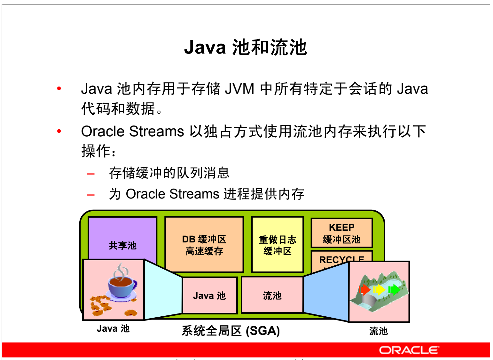

## Oracle DB 内存结构

一个实例有两个关联的基本内存结构:
* 系统全局区 (SGA)：一组共享的内存结构（称为 SGA 组件），其中包含一个 **Oracle DB 实例的数据和控制信息**。SGA 由所有服务器进程和后台进程共享
  * **共享池**：用于缓存可在用户间共享的各种构造
  * **数据库缓冲区高速缓存**：用于缓存从数据库中检索到的数据块
  * **KEEP缓冲区池**：一种专用数据库缓冲区高速缓存，用于长时间在内存中保留数据块
  * **RECYCLE缓冲区池**：一种专用数据库缓冲区高速缓存，用于从内存中快速回收或删除数据块
  * **nK缓冲区高速缓存**：多种专用数据库缓冲区高速缓存中的一种，用于存放大小不同于默认数据库块大小的数据块
  * **重做日志缓冲区**：重做信息（用于实例恢复）在写入磁盘中存储的物理重做日志文件之前，将缓存在此处
  * **大型池**：可选区域，用于为某些大型进程（例如 Oracle 备份和恢复操作）和 I/O 服务器进程提供大型内存分配
  * **Java池**：用于存储 Java 虚拟机 (JVM) 中特定于会话的所有 Java 代码和数据
  * **流池**：供 Oracle Streams 用来存储捕获和应用操作所需的信息
* 程序全局区 (PGA)：包含某个服务器进程或后台进程的数据及控制信息的内存区域。PGA 是 Oracle DB 在服务器进程或后台进程启动时创建的非共享内存。服务器进程对 PGA 的访问是独占式的。每个服务器进程和后台进程都具有自己的 PGA。

Oracle DB 使用初始化参数来创建和管理内存结构。管理内存的最简单方法是允许数据库自动管理和优化内存。在大多数平台上，您只需设置目标内存大小初始化参数(`MEMORY_TARGET`) 和最大内存大小初始化参数 (`MEMORY_MAX_TARGET`)，就可以做到这一点。

### 共享池

> “数据字典” 是数据库表和视图的集合，其中包含有关数据库、数据库结构及其用户的参考信息。在SQL语句语法分析期间，Oracle DB 会频繁访问数据字典。该访问操作对于Oracle DB 的持续操作来说至关重要。

Oracle DB 对数据字典的访问十分频繁，因此在内存中指定了两个特殊的位置来存放字典数据。

一个区域称为“**数据字典高速缓存**”，也称为**行高速缓存**，因为它以行的形式存放数据，而不是以缓冲区的形式存放数据（缓冲区用于存放完整的数据块）。内存中的另一个用于存放字典数据的区域称为“**库高速缓存**”。

所有 Oracle DB 用户进程都共享这两个高速缓存以便访问数据字典信息。

Oracle DB 使用**共享 SQL区域**（以及 PGA 中保留的专用SQL区域）来表示它所运行的每个SQL语句。Oracle DB 可识别两个用户执行相同SQL语句的情况，从而为这些用户重用共享SQL区域。

**共享SQL区域**包含给定SQL语句的语法分析树和执行计划。Oracle DB 通过为多次运行的SQL语句使用一个共享SQL区域来节省内存。当许多用户运行同一个应用程序时，同一SQL语句通常会多次运行。对新的SQL语句进行语法分析时，Oracle DB 会从共享池中分配内存，以便在共享SQL区域中存储语句。该内存的大小取决于语句的复杂性。

Oracle DB处理PL/SQL程序单元（过程、函数、程序包、匿名块和数据触发器）的方式与它处理单个SQL语句的方式十分相似。
* Oracle DB分配一个共享区域以存放程序单元在经过语法分析和编译之后的形式。
* Oracle DB分配一个专用区域，以便存放运行程序单元的会话所特有的值，包括局部变量、全局变量和程序包变量（也称为程序包实例化），并分配用于执行SQL的缓冲区。
* 如果多个用户运行同一个程序单元，则所有用户都使用同一个共享区域，但其各自的专用SQL区域都维护着一个单独的副本，用于存放特定于自身会话的值。
*PL/SQL程序单元中包含的单个SQL语句的处理方式与其它SQL语句的处理方式类似。无论这些SQL语句在PL/SQL程序单元中的来源如何，它们都使用共享区域来存放其语法分析表示，并且为运行语句的每个会话使用一个专用区域。

**SQL查询结果高速缓存**和**PL/SQL函数结果高速缓存**是 Oracle Database 11g 中新增的功能。它们共享相同的基础结构，出现在相同的动态性能 (`V$`) 视图中，并且使用所提供的同一程序包进行管理。

查询的结果和查询片段的结果可以高速缓存在**SQL查询结果高速缓存**的内存中。这样在将来执行这些查询和查询片段时，数据库可以使用高速缓存结果进行响应。由于从**SQL查询结果高速缓存**中检索结果要比重新运行查询快得多，因此将频繁运行的查询的结果缓存起来可以大大提高这些查询的性能。

如果计算的输入是PL/SQL函数发出的一个或若干个参数化查询，则有时会使用该函数来返回计算结果。在某些情况下，这些查询访问的数据很少更改（与调用函数的频率相比）。您可以在PL/SQL函数的源文本中包括语法，以请求将函数结果缓存在PL/SQL函数结果高速缓存中，并在有 DML 操作处理表列表中的表时清除高速缓存（以确保正确性）。

共享池的**固定区域**表示 SGA 的启动开销。与常见大小的共享池或 SGA 相比，它非常小。

### 数据库缓冲区高速缓存

数据库缓冲区高速缓存是 SGA 的一部分，用于**存放从数据文件中读取的块映像或动态构造的块映像**，以便符合**读一致性模型**要求。并行连接到实例的所有用户共享对数据库缓冲区高速缓存的访问。

Oracle DB 用户进程第一次请求特定数据片段时，将在**数据库缓冲区高速缓存**中搜索数据。

* 如果该进程在高速缓存中找到数据（称为`高速缓存命中`），则直接从内存中读取数据。
* 如果进程在高速缓存中找不到数据（称为`高速缓存未命中`），则在访问数据之前，必须将磁盘上的数据文件中的数据块复制到高速缓存中的缓冲区中。

高速缓存命中时访问数据的速度要比高速缓存未命中时快。

高速缓存中的缓冲区由一个复杂算法管理，该算法组合使用最近最少使用 (LRU) 列表和停靠计数。LRU 有助于确保最近使用的块往往都留在内存中，从而最大限度地减少磁盘访问。

**KEEP 缓冲区池**和 **RECYCLE 缓冲区池**用于优化专用缓冲区池。

* KEEP 缓冲区池用于延长缓冲区在内存中的保留时间，使其比使用 LRU 时的正常保留时间长。
* RECYCLE 缓冲区池用于加快内存中缓冲区的刷新速度，使其比使用 LRU 时的正常刷新速度快。

可以配置更多缓冲区高速缓存，以用于存放大小与默认块大小不同的块。

### 重做日志缓冲区

**重做日志缓冲区**是 SGA 中的一个**循环缓冲区**，用于存放有关对数据库所做更改的信息。此信息存储在重做条目中。重做条目包含重建（或重做）由 DML、DDL 或内部操作对数据库进行的更改所需的信息。需要时，将使用重做条目进行数据库恢复。

服务器进程更改缓冲区高速缓存时，将会生成重做条目，并将其写入 SGA 中的重做日志缓冲区。重做条目占用缓冲区中连续的顺序空间。日志写进程后台进程会将重做日志缓冲区写入磁盘上的活动重做日志文件（或文件组）中。

### 大型池

数据库管理员可以配置称为“大型池”的可选内存区，以便为以下对象提供大型内存分配：

* 共享服务器和 Oracle XA 接口（在事务处理与多个数据库交互时使用）的会话内存
* I/O 服务器进程
* Oracle DB 备份和还原操作
* 并行查询操作
* 高级排队内存表存储

通过从大型池中为共享服务器、Oracle XA 或并行查询缓冲区分配会话内存，Oracle DB 可以主要使用共享池来缓存共享 SQL，并避免由于收缩共享 SQL 高速缓存而导致的性能开销。

此外，用于 Oracle DB 备份和还原操作、I/O 服务器进程和并行缓冲区的内存空间需要以数百 KB 的缓冲区进行分配。与共享池相比，大型池可以更好地满足此类大型内存请求。

大型池不是由最近最少使用 (LRU) 列表管理的。

### Java 池和流池

Java 池内存用于存储 JVM 中所有特定于会话的 Java 代码和数据。Java 池内存的使用方式有多种，具体取决于 Oracle DB 的运行模式。

流池由 Oracle Streams 独占使用。流池存储缓冲的队列消息，并且为 Oracle Streams 捕获进程和应用进程提供内存。

除非对其进行专门配置，否则流池的大小从零开始。当使用 Oracle Streams 时，池大小会根据需要动态增长。

### 程序全局区 (PGA)

.png)

程序全局区 (PGA) 是一个专用内存区，其中包含**服务器进程的数据及控制信息**。每个服务器进程都有独立的 PGA。PGA 只能由相应的服务器进程访问，并且只有代表该服务器进程的 Oracle 代码可以读取它。开发人员的代码不能访问 PGA。

每个 PGA 都包含堆栈空间。在专用服务器环境中，连接到数据库实例的每个用户都有单独的服务器进程。对于这种类型的连接，PGA 包含一个名为用户全局区 (UGA) 的内存细分部分。UGA 包括以下部分：
* 游标区，用于存储游标的运行时信息
* 用户会话数据存储区，用于存储有关会话的控制信息
* SQL工作区，用于处理 SQL 语句，其中包括：
    * 排序区，用于对数据排序的函数，如 ORDER BY 和 GROUP BY
    * 散列区，用于执行表的散列联接
    * 位图创建区，用于创建数据仓库常用的位图索引
    * 位图合并区，用于解析位图索引计划的执行

在共享服务器环境中，多个客户机用户共享服务器进程。在这种模式下，UGA 将移入 SGA（共享池，如果经过配置也可是大型池），PGA 仅包含堆栈空间。