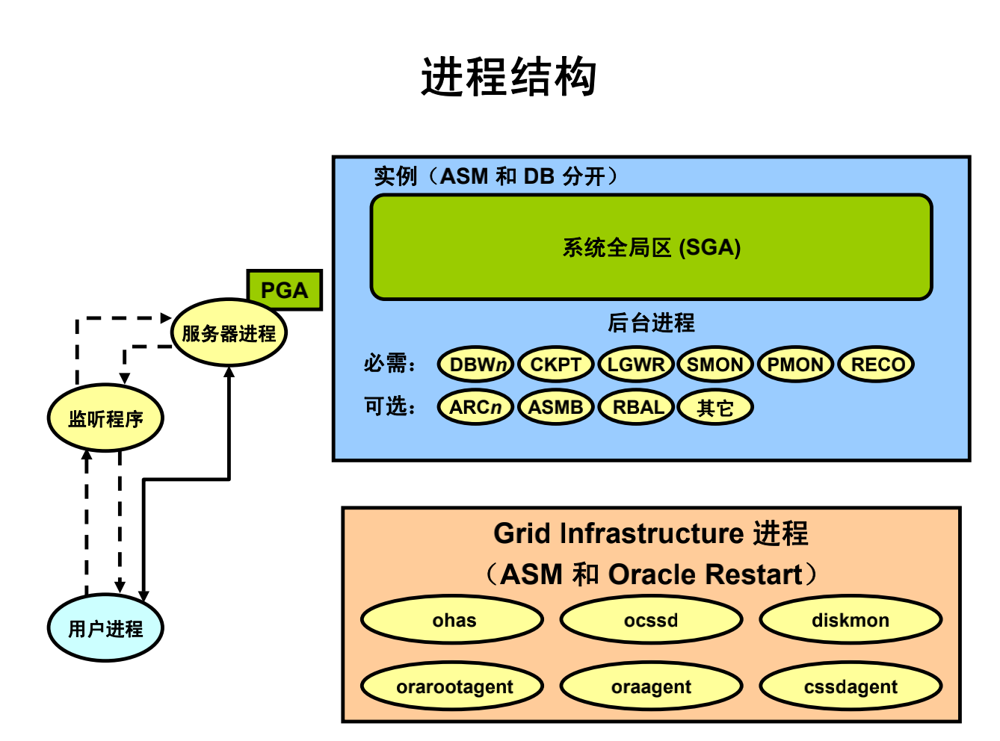

# Oracle 进程体系结构

Oracle DB 系统中的进程可以主要分为三组：

* 运行应用程序或 Oracle 工具代码的用户进程。

    用户进程: 是连接到 Oracle DB 的应用程序或工具

* 运行 Oracle DB 服务器代码的 Oracle DB 进程（包括服务器进程和后台进程）。
    
    数据库进程：

    * 服务器进程：连接到 Oracle 实例，在用户建立会话时启动
    * 后台进程：在启动 Oracle 实例时启动

* 非特定于单个数据库的 Oracle 守护程序和应用程序进程。

    即守护程序/应用程序进程：

    * 网络监听程序
    * Grid infrastructure 守护程序
  

专用服务器和共享服务器

> 已连接用户的代码可以配置为专用服务器或共享服务器

* 专用服务器：对于每个会话，运行数据库应用程序的用户进程都由执行 Oracle DB 服务器代码的专用服务器进程提供服务。
* 共享服务器：不必为每个连接都提供一个专用服务器进程。分派程序会将多个传入网络会话请求定向到共享服务器进程池。共享服务器进程为所有客户机请求提供服务。

非 RAC、非 ASM 环境中的常见后台进程包括：

* 数据库写进程 (DBW*n*) 
* 日志写进程 (LGWR) 
* 检查点进程 (CKPT) 
* 系统监视器进程 (SMON) 
* 进程监视器进程 (PMON) 
* 恢复器进程 (RECO) 
* 作业队列协调程序 (CJQ0) 
* 作业从属进程 (J*nnn*) 
* 归档进程 (ARC*n*) 
* 队列监视器进程 (QMN*n*)

> 有关后台进程的详细信息，请参见 `V$BGPROCESS` 视图。

Linux 和 UNIX 系统上的 Oracle Grid Infrastructure 进程包括：

* ohasd：Oracle 高可用性服务守护程序，负责启动 Oracle Clusterware 进程
* ocssd：集群同步服务守护程序
* diskmon：磁盘监视守护程序，负责监视 HP Oracle Exadata Storage Server 的输入和输出
* cssdagent：启动、停止和检查 CSS 守护程序 ocssd 的状态
* oraagent：扩展集群件以支持 Oracle 特有的要求和复杂资源
* orarootagent：一种专用的 Oracle 代理进程，可帮助管理 root 用户所拥有的资源（如网络）