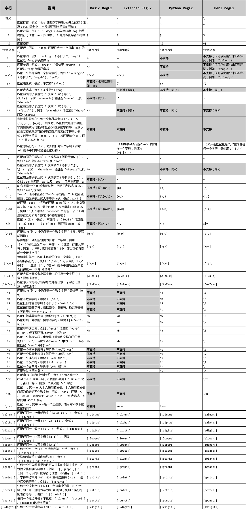

## 一、正则表达式分类

* **基本的正则表达式**, `Basic Regular Expression` 又叫 `Basic RegEx`  简称 `BREs`
* **扩展的正则表达式**, `Extended Regular Expression` 又叫 `Extended RegEx` 简称 `EREs`
* **Perl 的正则表达式**, `Perl Regular Expression` 又叫 `Perl RegEx` 简称 `PREs`

## 二、Linux 中常用文本工具与正则表达式的关系 

* `grep`/`egrep`:
    * `grep` 支持: `BREs`、`EREs`、`PREs` 正则表达式
        * `grep` 指令后不跟任何参数, 则表示要使用 "`BREs`" 
        * `grep` 指令后跟 "`-E`" 参数, 则表示要使用 "`EREs`"
        * `grep` 指令后跟 "`-P`" 参数, 则表示要使用 "`PREs`"

    * `egrep` 支持: `EREs`、`PREs` 正则表达式
        * `egrep` 指令后不跟任何参数, 则表示要使用 "`EREs`"
        * `egrep` 指令后跟 "`-P`" 参数, 则表示要使用 "`PREs`"

* `sed`:
    * `sed` 文本工具支持: `BREs`、`EREs`
    * `sed` 指令默认是使用 "`BREs`"
    * `sed` 命令参数 "`-r`" , 则表示要使用"`EREs`"

* `Awk`/`gawk`: 
    * awk 文本工具支持: EREs
    * awk 指令默认是使用 "EREs"

## 三、比较

> [`https://www.cnblogs.com/jiangzhaowei/p/5453004.html`](https://www.cnblogs.com/jiangzhaowei/p/5453004.html)

